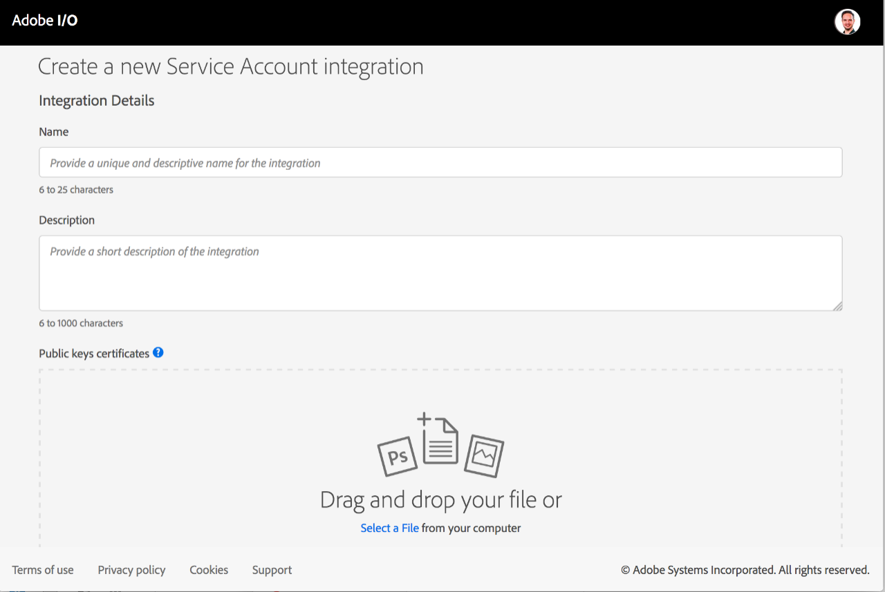
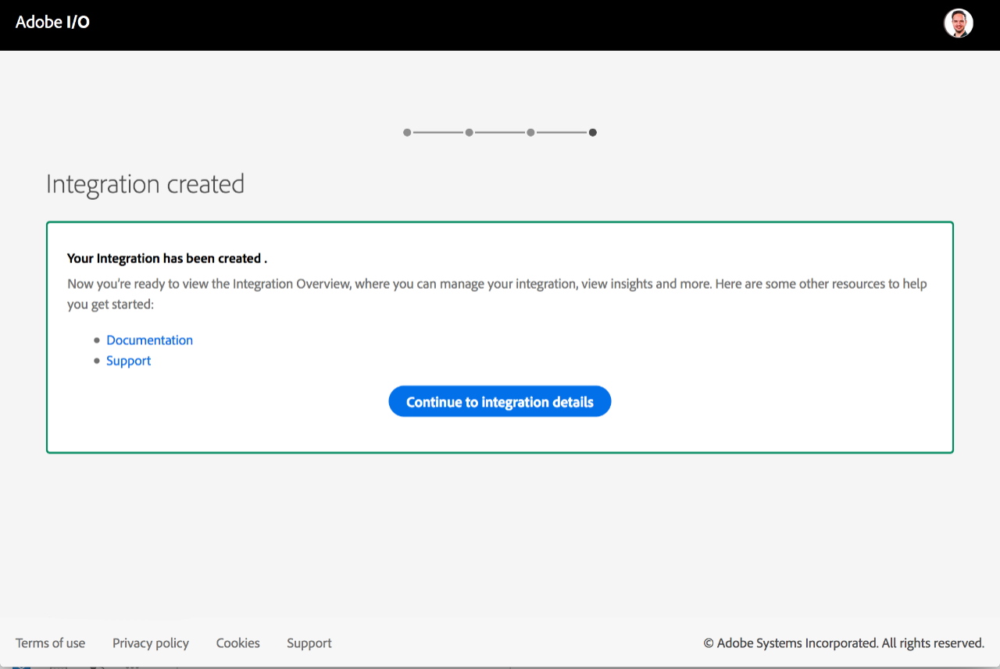
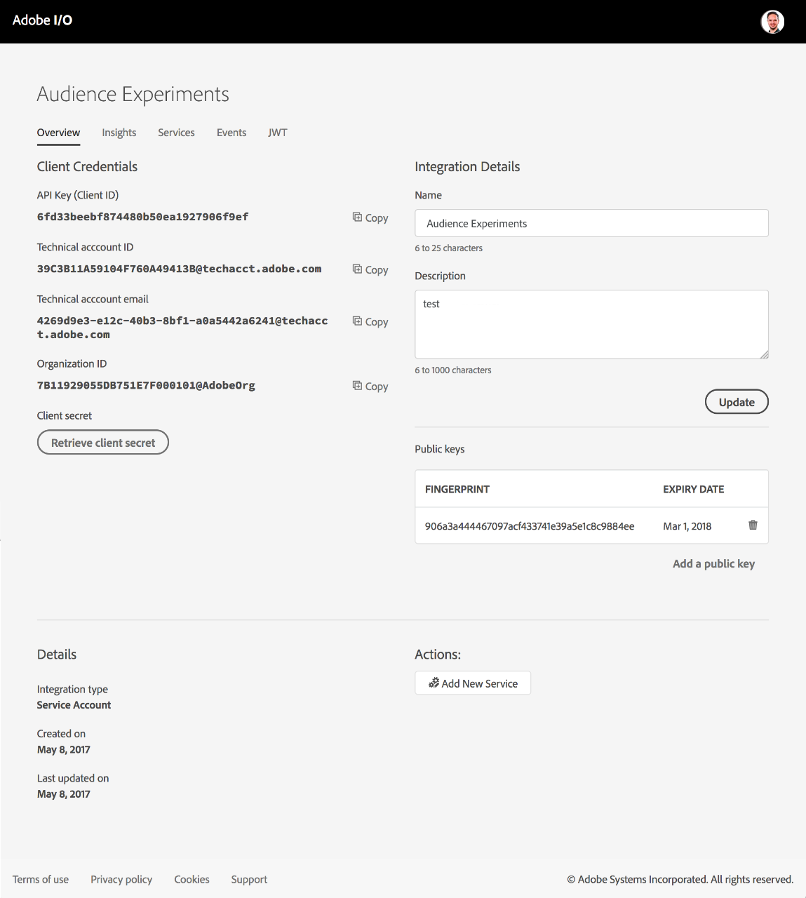
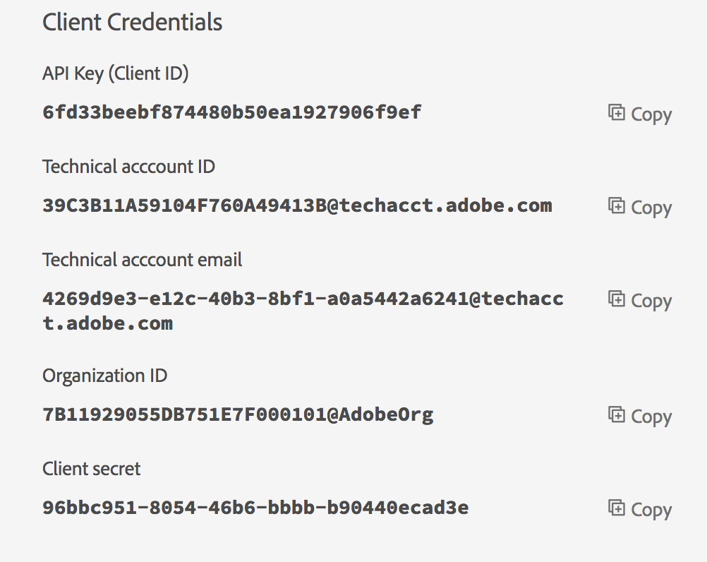

# Service Account Integration

If your application needs to access Adobe services or content, you'll need a set of client credentials to authenticate the identity of the caller and authorize access. The type of application you are building determines the type of integration that provides the client credentials you will need.

A Service Account integration allows your application to call Adobe services on behalf of the application itself, or on behalf of an enterprise organization.

For this type of integration, you will create a JSON Web Token (JWT) that encapsulates your credentials, and begin each API session by exchanging the JWT for an access token. The JWT encodes all of the identity and security information required to obtain an access token, and must be signed with the private key that is associated with a public key certificate specified on your integration.

This article walks you through the steps to set up a Service Account integration.

Your integrated application will begin each API session by exchanging the JWT for an access token from the Adobe Identity Management System (IMS). The application must pass the access token with every request in the **Authorization : Bearer** header. An access token expires after 24 hours. This type of token cannot be refreshed. For complete details of this exchange, see [JWT Authentication Reference](connect.md).

## The JWT Workflow

1. [Create a Public Key Certificate](jwt_workflow.md#step-1-create-a-public-key-certificate)
1. [Subscribe to a Service or Event Provider](jwt_workflow.md#step-2-subscribe-to-a-service-or-event-provider)
1. [Configure a Service Account Integration](jwt_workflow.md#step-3-configure-a-service-account-integration)
1. [Secure your Client Credentials](jwt_workflow.md#step-4-secure-your-client-credentials)
1. [Create your JSON Web Token (JWT)](jwt_workflow.md#step-5-create-your-json-web-token)
1. [Exchange your JWT for an Access Token](jwt_workflow.md#step-6-exchange-your-jwt-for-an-access-token)

### Step 1: Create a Public Key Certificate

Each Service Account integration must be associated with at least one valid public key certificate (commonly known as digital certificate) that verifies the identity of your application.

1. Create or purchase a public key certificate. You can purchase one from a vendor, or create your own using **openssh** in Mac OS, or Cygwin in Windows, which includes **openssh**.
1. Upload and attach the digital certificate file to a Service Account integration, using the [Adobe I/O Console](https://console.adobe.io/).
1. Use the private key to sign your JWT, as described below. When you start an API session, Adobe uses the corresponding digital certificate to decode the JWT.

It is extremely important to properly secure your private key. It cannot be recovered or replaced. If you lose the private key or it is compromised, you must delete the corresponding digital certificate from your integration.

Your Service Account integration must be associated with at least one valid certificate. You can associate more than one certificate with an integration. This is helpful for certificates that have an expiration. Ideally, you will provide multiple certificates on an integration with overlapping lifespans to ensure your integration is always operational. You can use the private key of any associated certificate to sign your JWT.

Adobe does not check for revocation or trust chains of the certificate. If you want to revoke a certificate that you have associated with an API key, you must do so explicitly using the [Adobe I/O Console](https://console.adobe.io/). When you have done so, you can no longer use any JWT signed with the private key for that certificate to gain access to the Adobe I/O API.

To add or remove certificates, simply edit and update your Integration using the [Adobe I/O Console](https://console.adobe.io/).
For more information about creating self-signed certificates and extracting keys from purchased certificates, see [Public Key Certificates for JWT](createcert.md).

## Step 2: Subscribe to a Service or Event Provider

To generate client credentials needed to access an Adobe service or event, create a new **Service Account Integration**. An integration can subscribe to multiple services and events. If you want to use an existing integration, simply subscribe to the new service.

To create an integration of this type, sign in to the [Console](https://console.adobe.io/) with your Enterprise ID, and click **New Integration**.


Your Enterprise ID must have administrative privileges for your organization to be able to create a new Service Account integration. If you do not have the required permissions, contact an IT Administrator at your company for help. This is typically the person who distributes Creative Cloud, Acrobat, or Marketing Cloud licenses within your company.

Select **Consume services** to create an integration that will access an Adobe product or service, or select **Subscribe to events** to receive event notifications in real-time. You will have an opportunity to subscribe to additional events and services once you have created the integration.


- Consume services
  Services are the primary way your integration can access Adobe APIs and content. Some services are product specific, while other services provide unique functionality that can be used across products. We encourage you to mix and match services to build the best experience possible for your end users.

- Subscribe to events
  Adobe I/O Events allow you to build integrations that respond to changes in a user's cloud data in real time. Select this option if your integration needs to instantly process content or data stored in an Adobe cloud. You must supply a **webhook**, which is the URL to which event notifications are sent.

Choose the service you want to add to your integration. APIs and products available through Adobe I/O are typically listed by cloud. However, some services span multiple clouds, such as User Management and I/O Events.


Many services are only available through the purchase of a product; for example, Adobe Campaign and Document Cloud PDF Services. If your organization has not been entitled to these services, the options are disabled. If you believe you should have access to a disabled service please contact your Adobe sales representative.

Some services (such as Adobe Stock) can be accessed with different types of authentication. For integrations that need to access services or content on behalf of an organization (rather than an end user), select the Service Account integration option.

If you are integrating with events, choose the event source.


If you have an existing integration that is compatible with the service you have selected, you can update that integration with access to the selected service.


To update an existing integration, simply select it and click Continue.
If you would like to create a brand new integration, select that option and click Continue.

### Step 3: Configure a Service Account Integration

The configuration page lets you provide all of the required configuration information for a new integration, or add new information to update an existing integration for access to an additional service.



On this page:

1. Enter an **Integration Name** and **Description**. If you have multiple applications or access multiple services, you can use these properties to better organize your integrations. Tip: Give your integrations accurate and descriptive names. Integrations are shared with developers within your organization, so choose a name that is clear and easily understood. Generic names like My Test App are discouraged.
1. Upload the **public key certificate** that you created or purchased. You can upload more than one certificate now, or edit the integration later to add more certificates, or remove a certificate.
1. Click **Create integration**.



When creation is confirmed, visit the overview section for your new integration. The overview shows your generated credentials, and allows you to subscribe to additional services or events.

### Step 4: Secure your Client Credentials

Each integration contains a unique set of generated client credentials. These credentials are used to identify your application and grant API access to Adobe services.



- The API Key (or Client ID) should be considered public information. It is passed with every API request to identify your integration.
- Technical Account ID and Organization ID are technical details used to create your JSON Web Token (JWT).
- By default, the Client Secret is not displayed. Click **Retrieve Client Secret** to temporarily display the property.

(Note that the example values shown here are for illustration only. You must use the credential values assigned to your own integration.)



The Client Secret must be kept confidential and should be treated like a private password or the private key of your certificate. If a Client Secret is not properly secured it can result in malicious activity which may require Adobe to block access to all services and products associated with the integration. Adobe recommends that you store this information in a credential management system or implement strict permissions that only permit access to authorized users.

To keep your credentials secure, make sure you do NOT include them in your source code, or inject them through environment variables. Similarly, you should never send credentials through unsecured email or other unsecured communications.

### Step 5: Create your JSON Web Token

Use your client credentials generated for your integration to create a JWT, and sign it with your private key. The JWT encodes all of the identity and security information that Adobe needs to verify your identity and grant you access to Adobe services and events.

Several public libraries are available for creating a JWT. The JWT must be digitally signed and base-64 encoded for inclusion in the access request. For details of what libraries are available and what fields must be included in your JWT, see [Creating a JSON Web Token](createjwt.md).

You are responsible for securing your JWT along with your other access credentials.

### Step 6: Exchange your JWT for an Access Token

To initiate an API session, you use the JWT to obtain an access token from Adobe, by making a POST request to Adobe's Identity Management Service (IMS).

- Send a POST request to:

  > `https://ims-na1.adobelogin.com/ims/exchange/jwt/`

- The body of the request should contain URL-encoded parameters with your Client ID (API Key), Client Secret, and JWT:
  > `client_id={api_key_value}&client_secret={client_secret_value}&jwt_token={base64_encoded_JWT}`

For complete details of this exchange, see [JWT Authentication Reference](connect.md).

This call is the equivalent of a log-in. The response contains an OAuth access token that is valid for a fixed period of time, as configured for your application. You must pass a valid access token to each request that you make to the Adobe I/O API.

### Example token exchange

To validate your newly created token, use it to make a test request of the API. In the following example the actual credential and token values are represented with curly brackets.

| Credential     | Representation  | Example                              |
| -------------- | --------------- | ------------------------------------ |
| API Key        | {client-id}     | ec9a2091e2c64f0492c6486547003018     |
| Client Secret  | {client-secret} | 6dd58fb8-847c-4428-ac8d-ced269914e31 |
| JSON Web Token | {encoded-jwt}   | very long encoded value              |
| Access Token   | {encoded-token} | very long encoded value              |

#### Sample Request

```
curl -X POST \
  https://ims-na1.adobelogin.com/ims/exchange/v1/jwt \
  -H 'cache-control: no-cache' \
  -H 'content-type: application/x-www-form-urlencoded' \
  -d 'jwt_token={encoded-jwt}&client_id={client-id}&client_secret={client-secret}'
```

#### Sample Response

```
{
  "token_type": "bearer",
  "access_token": "{encoded-token}",
  "expires_in": 86399981
}
```
