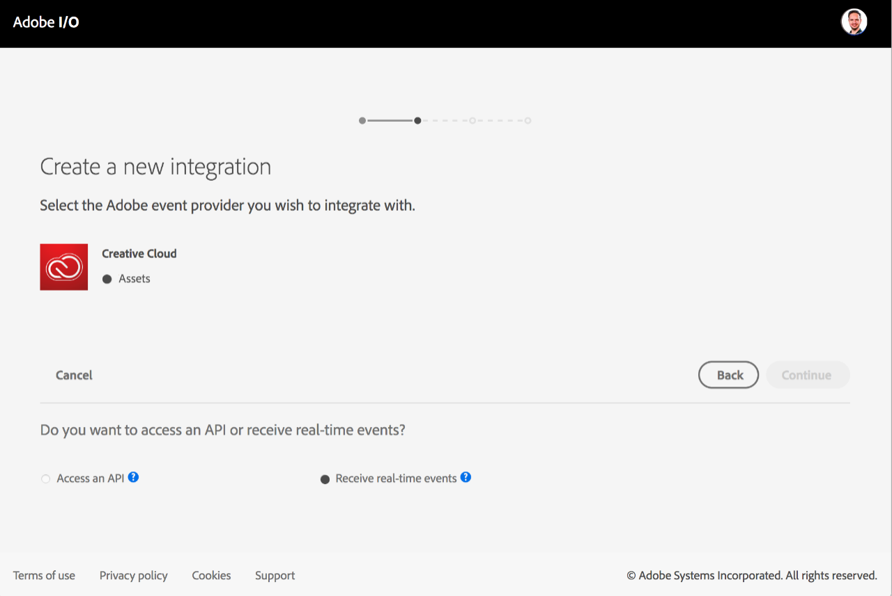
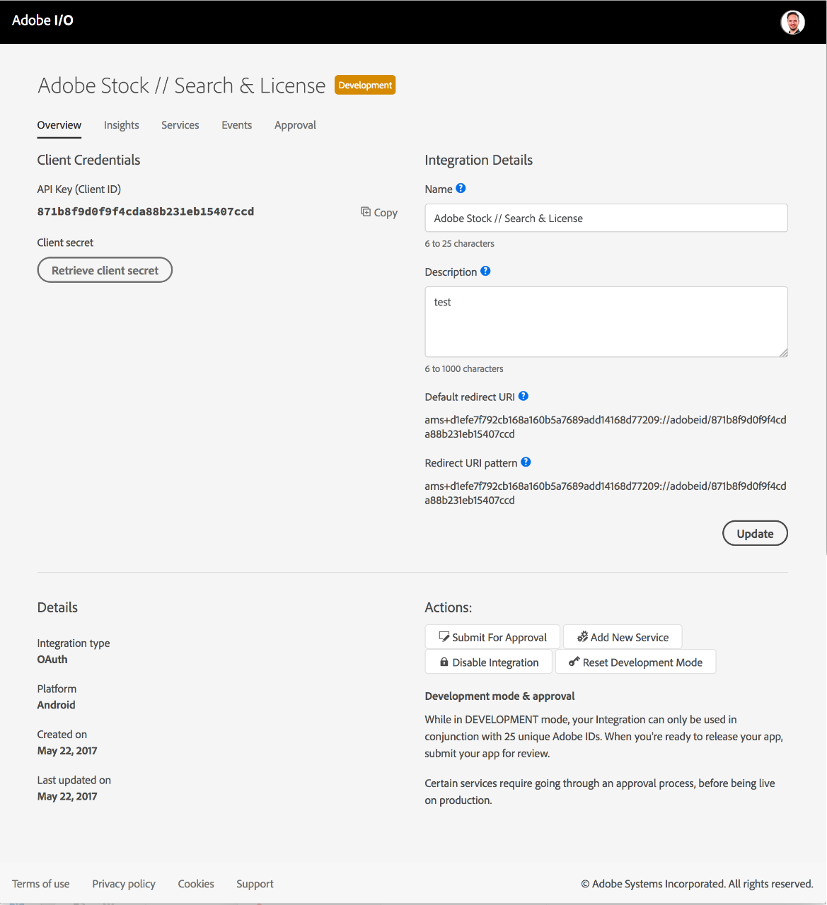
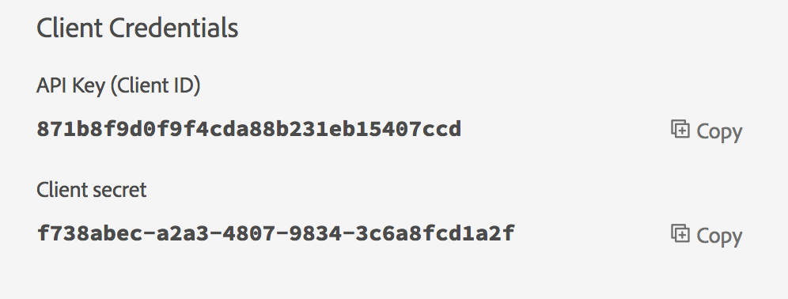

# OAuth Integration

If your application needs to access Adobe services or content, you'll need a set of client credentials to authenticate your app and your user, and authorize access. The type of integration you are building will determine the type of client credentials you will need.

To obtain client credentials for an app that accesses services on behalf of an end-user, you'll need to create an **OAuth Integration** using the [Adobe I/O Console](https://console.adobe.io/). You can integrate your app with more than one Adobe service. This article will walk you through the steps to set up an OAuth integration.

OAuth allows your end users to sign in to your integration with an Adobe ID. With an OAuth token, your integration will be able to access Adobe services or content on behalf of the logged in user.

If your integration needs to access Adobe services or content on behalf of an organization (an Adobe enterprise organization), check out the [Service Account Authentication](jwt_workflow.md) article.

## The OAuth Authorization Workflow

1. [Subscribe to a Service or Events](oauth_workflow.md#step-1-subscribe-to-a-service-or-events)
1. [Configure an OAuth Integration](oauth_workflow.md#step-2-configure-an-oauth-integration)
1. [Secure your Client Credentials](oauth_workflow.md#step-3-secure-your-client-credentials)
1. [Initiate User Authentication](oauth_workflow.md#step-4-initiate-user-authentication)

### Step 1: Subscribe to a Service or Events

To create a new OAuth Integration, sign in to the [Adobe I/O Console](https://console.adobe.io/) with your Adobe ID, and click **New Integration**. (Notice that you can also choose existing Integrations and edit their details from here.)

Choose the type of service or event source you want to include in your integration. You can get API access to several Adobe services or subscribe to real-time events. An integration can access multiple services and event sources. Simply perform these steps for each service or event you want to add to your integration.

Select **Access an API** to create an integration that will access an Adobe product API or service, or select **Receive real-time events** to be notified of events in real time. You will have an opportunity to subscribe to additional services and events once you have created the integration.

* Consume services
Services are the primary way your integration can access Adobe APIs and content. Some services are product specific, while other services provide unique functionality that can be used across products. We encourage you to mix and match services to build the best experience possible for your end users.

* Subscribe to events
Adobe I/O Events allow you to build integrations that respond to changes in a users cloud data in real time. Select this option if your integration needs to instantly process content or data stored in an Adobe cloud. You must supply a webhook, which is the URL to which event notifications are sent.

Choose the service that you would like to add to your integration. APIs and products available through Adobe I/O are typically listed by cloud. However, some services span multiple clouds, such as User Management and I/O Events.

Many services are only available through the purchase of a product, for example Adobe Campaign and Document Cloud PDF Services. If your organization has not been entitled to these services, the options are disabled. If you believe you should have access to a disabled service, please contact your Adobe sales representative.

Some services (such as Adobe Stock) can be accessed with different types of authentication. For integrations that need to access services or content on behalf of a logged-in user, select the OAuth integration option.

If you are integrating with events, choose the event source.

If you have an existing integration that is compatible with the service you have selected, you can update that integration with access to the selected service.

* To update an existing integration, simply select it and click **Continue**.
* If you would like to create a brand new integration, select that option and click **Continue**.

### Step 2: Configure an OAuth Integration

The configuration page lets you provide all of the required configuration information for a new integration, or add new information to update an existing integration for access to an additional service.

On this page:

1. Enter an **Integration Name** and **Description**. If you have multiple applications or access multiple services, you can use these properties to better organize your integrations. **Tip: Give your integrations accurate and descriptive names**. Integrations are shared with developers within your organization, so choose a name that is clear and easily understood. Generic names like _My Test App_ are discouraged.
1. Specify the platform for your new integration (Web, Android, or iOS).
1. Specify the **Default Redirect URI** and **Redirect URI Patterns**. This tells Adobe where to direct your end users during or after the Adobe ID login process.
1. Prove that you are not a robot. If you are a robot, please contact the Adobe I/O team to negotiate a peaceful alternative to your impending rebellion against humanity.
1. Click **Create integration*.

When creation is confirmed, visit the Overview page for your new integrations that contains the newly generated credentials, and allows you to subscribe to additional services or events.

### Step 3: Secure your Client Credentials

Each integration contains a unique set of generated client credentials. These credentials are used to identify your application and grant API access to Adobe services.

The API Key (or Client ID) should be considered public information. It will be passed with every API request to identify your integration.

By default, the Client Secret will not be displayed. Click Retrieve Client Secret to temporarily display the property.

The Client Secret must be kept confidential and should be treated like a private password. If a Client Secret is not properly secured it can result in malicious activity, which may require Adobe to block access to all services and products associated with the integration. Adobe recommends that you store this information in a credential management system or implement strict permissions that only permit access to authorized users.

To keep your credentials secure, make sure you do NOT include them in your source code, or inject them through environment variables. Similarly, you should never send credentials through unsecured email or other unsecured communications.

### Step 4: Initiate User Authentication

An access token is required for every API request made on behalf of an end user. Your application will gain a unique access token following the successful login of an end user.

Currently, OAuth client credentials are supported only for Creative Cloud. The Creative SDK provides pre-built components for mobile and web to make authentication quick and easy. If you are building an application that integrates with the Creative Cloud, you can learn more about the User Auth UI at https://creativesdk.adobe.com.

For a complete discussion and examples of how to tie into the Auth UI Component of Creative SDK, see the Creative SDK documentation:

* For Web: [User Auth UI](https://creativesdk.adobe.com/docs/web/#/articles/userauthui/index.html).
* For Android: [User Auth UI](https://creativesdk.adobe.com/docs/android/#/articles/userauth/index.html).
* For iOS: [Integrating the Authentication Component](https://creativesdk.adobe.com/docs/ios/#/articles/gettingstarted/index.html#integrating_auth).
