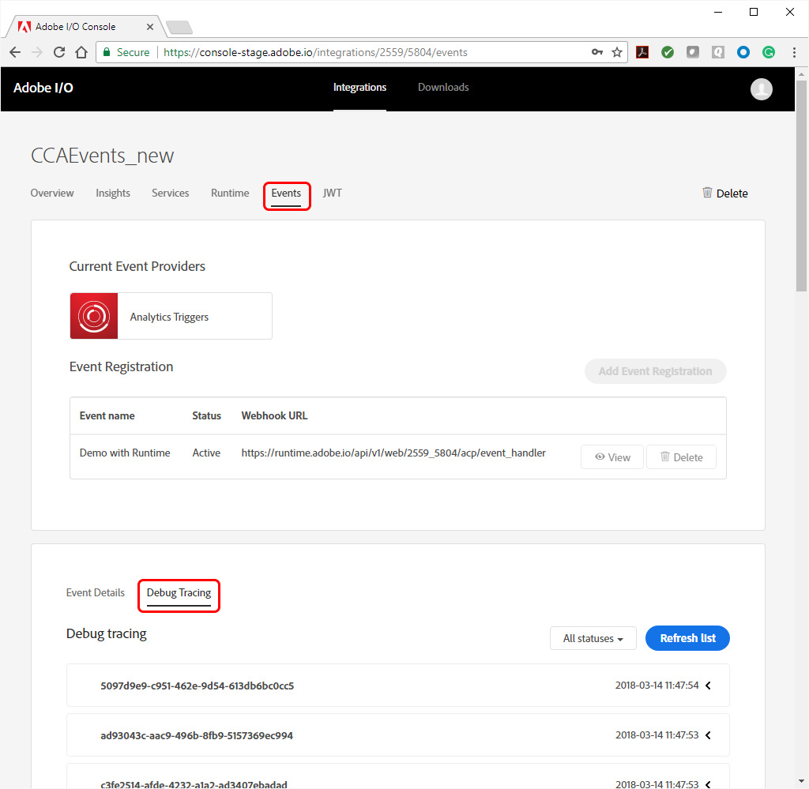
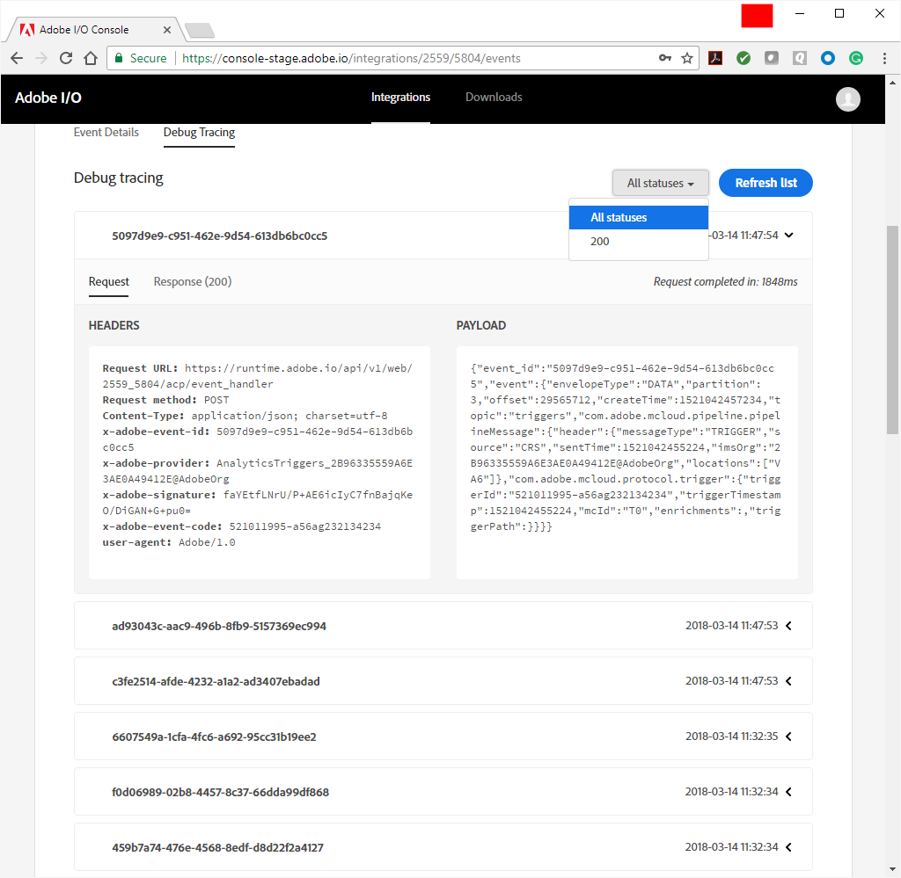
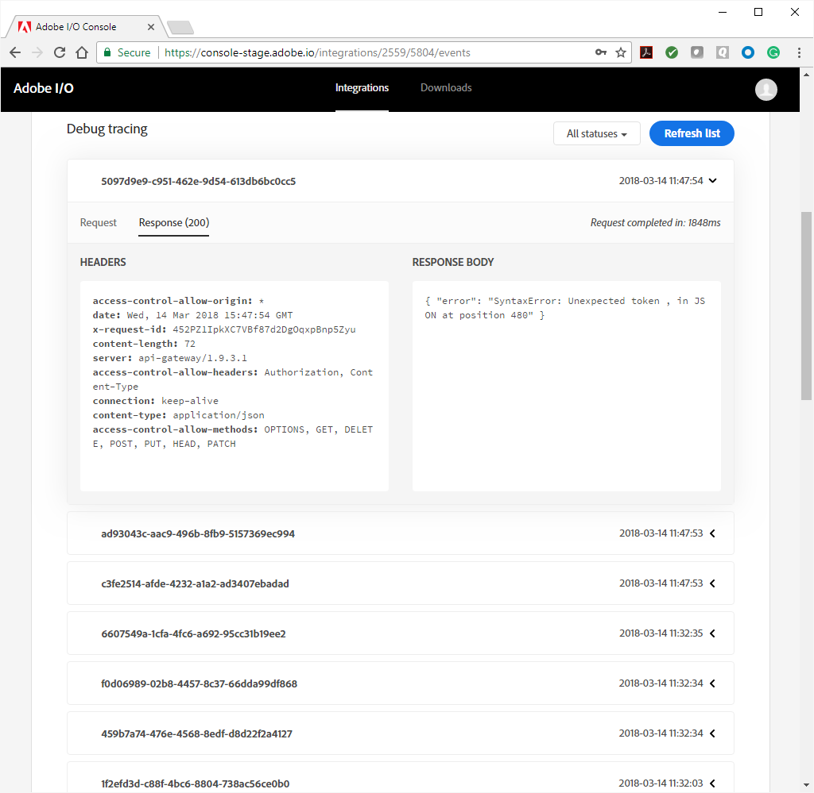

<!--:navorder: 2-->

# Tracing Adobe I/O Events

For help in debugging and analysis, Adobe offers Debug Tracing. Using Debug Tracing, you can inspect the activity between the Adobe service and your integration to see what data is being sent and how your integration is responding. This information can be of critical importance to your debugging efforts. Tracing data is retained for 7 days.

**To access Debug Tracing:**

1. Log into [Adobe I/O Console](https://console.adobe.io) and select your integration.

2. From the Integration Details view, select the Events tab. 

3. Below the event providers section, select the Debug Tracing tab. You will see a list of events, beginning with the most recent.

    

4. On the Debug Tracing tab, you can choose to view all events, or just those with HTTP 200 status (success) responses. Select any event in the list to expand its view and see its details. By default, the request (sent by Adobe) is shown, with headers and body.

    

5. Select the Response tab to view your integration's response to the event.

    

By inspecting the details of the request and response, you can examine the communication loop between Adobe and your integration to diagnose any breakdown in the flow or processing of events. 
