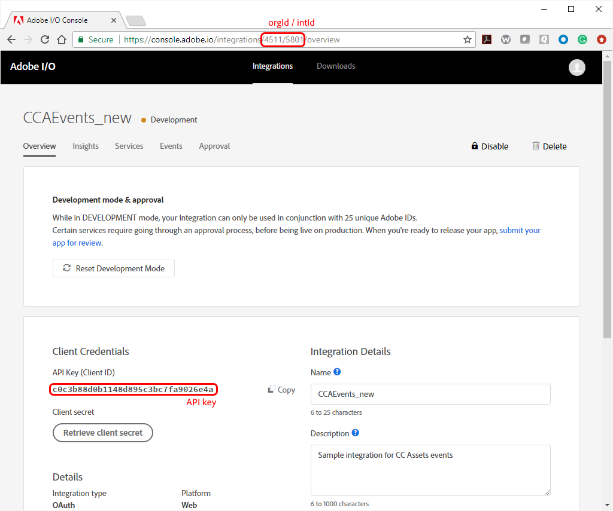

<!--:nav_order:2-->

# Working with Events Using the Adobe I/O Management API

- [Events API calls in the I/O Management API](#eventsapicallsintheadobeiomanagementapi)
- [Calling APIs](#callingapis)
- [API Specifications:](#apispecifications)
    - [GET /events/organizations/{orgId}/integrations/{intId}/registrations](#get-all-regs)
    - [POST /events/organizations/{orgId}/integrations/{intId}/registrations](#post-reg-webhook)
    - [GET /events/organizations/{orgId}/integrations/{intId}/registrations/{registrationId}](#get-reg-details)
    - [GET /events/organizations/{orgId}/integrations/{intId}/tracing/{registrationId}](#get-tracing)
    - [GET /events/organizations/{orgId}/integrations/{intId}/{registrationId}](#get-journal)

As an open system, Adobe Cloud Platform allows you access through APIs to just about any functionality you need. This includes events. The Adobe I/O Management API provides several API calls that enable you to manage events programmatically. 

Adobe APIs are accessible through HTTP GET and POST methods. The API responds with the appropriate HTTP response code (200 for success) and a JSON object (response content type: `application/json`) containing the information requested.

Make sure that the `I/O Management API` is added as a service in your integration (using the `Services` tab in the I/O Console), in order to be able to invoke the various APIs described here.

## Events API calls in the Adobe I/O Management API
The following calls enable Events management in the 
Adobe I/O Management API:

| Operation | Response | Description |
|---|---|---|
| `GET /events/organizations/{orgId}/integrations/{intId}/registrations` | Array of registrations | Get details for all registrations |
| `POST /events/organizations/{orgId}/integrations/{intId}/registrations` | Registration | Creates a client application's Webhook/Journal registration |
| `GET /events/organizations/{orgId}/integrations/{intId}/registrations/{registrationId}` | Registration | Get a specific registration details |
| `GET /events/organizations/{orgId}/integrations/{intId}/tracing/{registrationId}` | Registration | Get a specific WebHook tracing details |
| `GET /events/organizations/{orgId}/integrations/{intId}/{registrationId}` | LIst of events | Get all events for a registration |

**Parameters:**  
The APIs for events management have several parameters in common, as shown in this table. Parameters specific to individual APIs are given in detail below:

| Parameter | Location | Type | Description |  
|---|---|---|---|
| `x-ims-org-id` | header | string | Your organization&rsquo;s Adobe Identity Management Service ID. This is retrievable from the Overview tab of your integration, under &ldquo;Organization ID&rdquo;. |  
| `orgId` | path | string | A unique ID for your organization, specific to Adobe I/O. |  
| `intId` | path | string | The ID for your integration. |  
| `registrationId` | path | string | A GUID identifying a single registration for an event provider associated with your integration. |
| `Authorization` | path | string | A JWT token; see [Authentication: Creating a JWT Token](https://www.adobe.io/apis/cloudplatform/console/authentication/createjwt.html) for how to create a JWT token.  |
| `x-api-key` | path | string | Your integration&rsquo;s API key. This is displayed in the Overview tab for your integration in the Adobe I/O Console. |

## Calling APIs
To call an API, you simply need to issue the appropriate GET or POST method with all the parameters in place. Here is a sample, issued as a curl command:

```
curl -H “Authorization: Bearer $USER_TOKEN” -H “x-api-key: $API_KEY” 
https://api.adobe.io/events/organizations/2316/integrations/5670/registrations/fa28f4d0-3438-429f-98b8-0a25cb49498b
```

To retrieve your `orgId`, `intId`, and API key (which is used for the `x-api-key` parameter), view your integration's details:



The `orgId` and `intId` parameters are shown in the URL for your integration, while the API key is shown on the Overview tab under Client Credentials.

To retrieve your `registrationId`, issue the API call to retrieve details of all your registrations: 

```
curl -H “Authorization: Bearer $USER_TOKEN” -H “x-api-key: $API_KEY” 
https://api.adobe.io/events/organizations/2316/integrations/5670/registrations
```

The response will include the `registrationId` for every event registration you have associated with the given integration.

## API Specifications
This section provides information on parameters and responses for each API call.

<a id="get-all-regs">&nbsp;</a>
### `GET /events/organizations/{orgId}/integrations/{intId}/registrations`
Given the Client ID (API key) and `orgId` provided, this gets a JSON array of all the event registrations associated with the integration given by `intId`.

**Required Parameters:**  
`orgId`, `intId`, `Authorization`, `x-api-key`

**Optional parameters:**
| Parameter | Type | Location | Description |
|---|---|---|---|
| `x-ims-org-id` | string | header | See above table |
| `delivery_type` | string | query | Specifies the format of the JSON response as either WEBHOOK or JOURNAL. |

_Response model:_
```json
[
  {
    "id": 0,
    "client_id": "string",
    "name": "string",
    "description": "string",
    "parent_client_id": "string",
    "webhook_url": "string",
    "status": "ACCEPTED",
    "type": "USER",
    "integration_status": "ENABLED",
    "events_of_interest": [
      null
    ],
    "registration_id": "string",
    "delivery_type": "WEBHOOK",
    "events_url": "string",
    "created_date": "string",
    "update_date": "string",
    "runtime_action": "string"
  }
]
```

<a id="post-reg-webhook">&nbsp;</a>
### `POST /events/organizations/{orgId}/integrations/{intId}/registrations`
Given the `orgId` and `intId`, along with a JSON object in the body of the call, registers a webhook endpoint for the given integration.

**Required Parameters:**  
`orgId`, `intId`, `Authorization`, `x-api-key`

**Optional parameters:**
| Parameter | Type | Location | Description |
|---|---|---|---|
| `x-ims-org-id` | string | header | See above table |
| `body` | JSON | body | JSON object providing details for registering a webhook |

_Body model:_
```json
{
  "id": 0,
  "client_id": "string",
  "name": "string",
  "description": "string",
  "parent_client_id": "string",
  "webhook_url": "string",
  "status": "ACCEPTED",
  "type": "USER",
  "integration_status": "ENABLED",
  "events_of_interest": [
    null
  ],
  "registration_id": "string",
  "delivery_type": "WEBHOOK",
  "events_url": "string",
  "created_date": "string",
  "update_date": "string",
  "runtime_action": "string"
}
```

_Response model:_
```json
[
  {
    "id": 0,
    "client_id": "string",
    "name": "string",
    "description": "string",
    "parent_client_id": "string",
    "webhook_url": "string",
    "status": "ACCEPTED",
    "type": "USER",
    "integration_status": "ENABLED",
    "events_of_interest": [
      null
    ],
    "registration_id": "string",
    "delivery_type": "WEBHOOK",
    "events_url": "string",
    "created_date": "string",
    "update_date": "string",
    "runtime_action": "string"
  }
]
```

<a id="get-reg-details">&nbsp;</a>
### `GET /events/organizations/{orgId}/integrations/{intId}/registrations/{registrationId}`
Given the `orgId`, `intId`, and `registrationId`, this gets the details for the given webhook registration.

**Required Parameters:**  
`orgId`, `intId`, `registrationId`, `Authorization`, `x-api-key`

**Optional parameters:**
| Parameter | Type | Location | Description |
|---|---|---|---|
| `x-ims-org-id` | string | header | See above table |

_Response model:_
```json
{
  "id": 0,
  "client_id": "string",
  "name": "string",
  "description": "string",
  "parent_client_id": "string",
  "webhook_url": "string",
  "status": "ACCEPTED",
  "type": "USER",
  "integration_status": "ENABLED",
  "events_of_interest": [
    null
  ],
  "registration_id": "string",
  "delivery_type": "WEBHOOK",
  "events_url": "string",
  "created_date": "string",
  "update_date": "string",
  "runtime_action": "string"
}
```

<a id="get-tracing">&nbsp;</a>
### `GET /events/organizations/{orgId}/integrations/{intId}/tracing/{registrationId}`
Given the `orgId`, `intId`, and `registrationId`, this gets webhook tracing data for the given webhook registration.

**Required Parameters:**  
`orgId`, `intId`, `registrationId`, `Authorization`, `x-api-key`

**Optional parameters:**
| Parameter | Type | Location | Description |
|---|---|---|---|
| `x-ims-org-id` | string | header | See above table |

_Response model:_
```json
[
  {
    "id": "string",
    "date": "string",
    "clientId": "string",
    "registrationId": "string",
    "trace": {
      "tracingRequest": {
        "requestUrl": "string",
        "requestMethod": "string",
        "contentType": "string",
        "requestBody": "string",
        "requestHeaders": {
          "additionalProp1": [
            "string"
          ],
          "additionalProp2": [
            "string"
          ],
          "additionalProp3": [
            "string"
          ]
        }
      },
      "tracingResponse": {
        "responseBody": "string",
        "responseCode": 0,
        "responseTime": 0,
        "responseHeaders": {
          "additionalProp1": [
            "string"
          ],
          "additionalProp2": [
            "string"
          ],
          "additionalProp3": [
            "string"
          ]
        }
      },
      "ts": 0,
      "deliveryTime": 0
    }
  }
]
```

<a id="get-journal">&nbsp;</a>
### `GET /events/organizations/{orgId}/integrations/{intId}/{registrationId}`
Given the `orgId`, `intId`, and `registrationId`, this gets a journal (list) of events for the given registration. For more details, see 
[Journaling API](./journaling_api.md).

**Required Parameters:**  
`orgId`, `intId`, `registrationId`, `Authorization`, `x-api-key`

**Optional parameters:**
| Parameter | Type | Location | Description |
|---|---|---|---|
| `x-ims-org-id` | string | header | See above table |
| `pageSize` | integer | query | Specifies the number of most recent events to retrieve |
| `from` | string | query | Specified the eventId of the first event to retrieve |

_Response model:_
```json
[
  {
    "events": [
      "string"
    ],
    "next": "string"
  }
]
```
