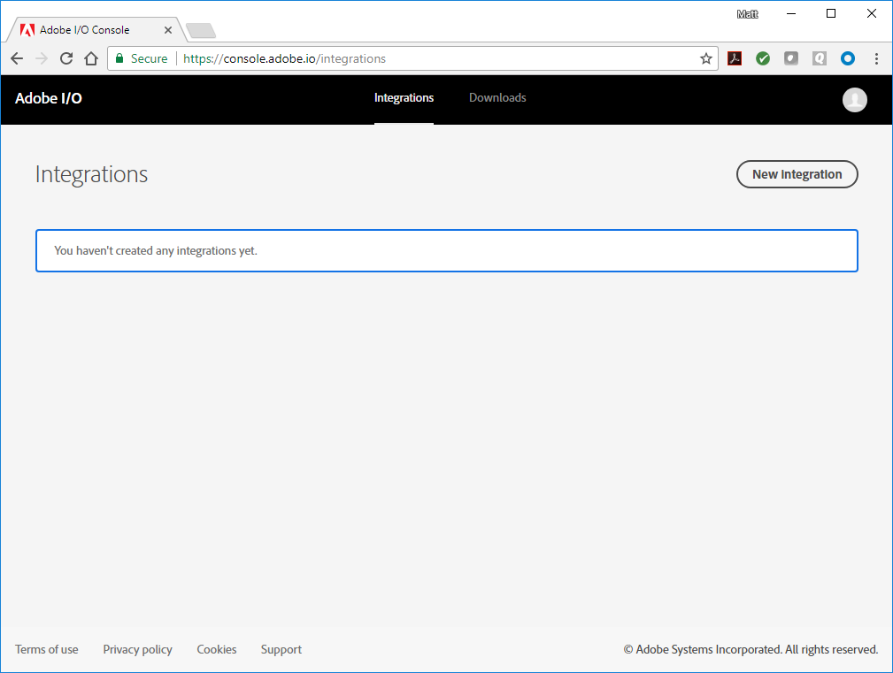
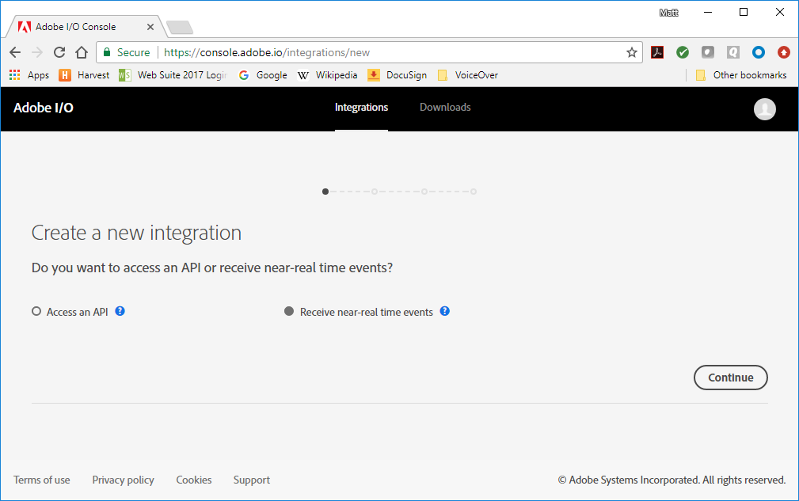
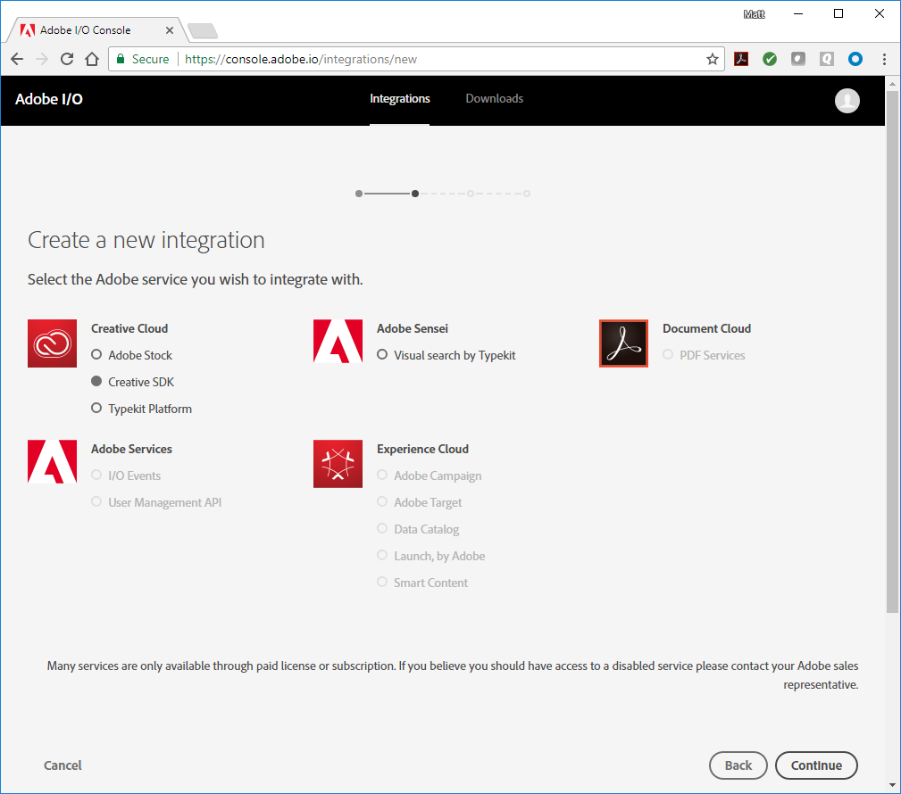
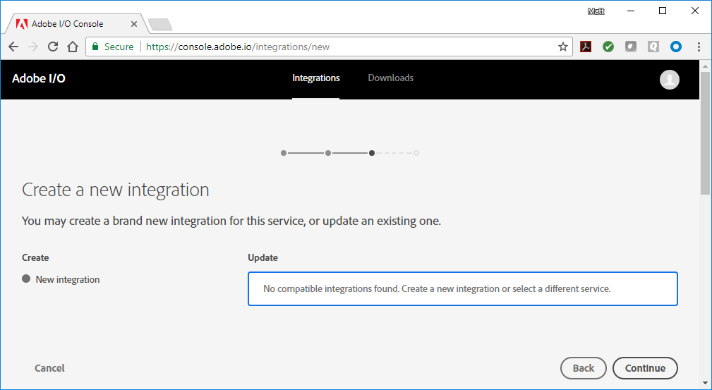
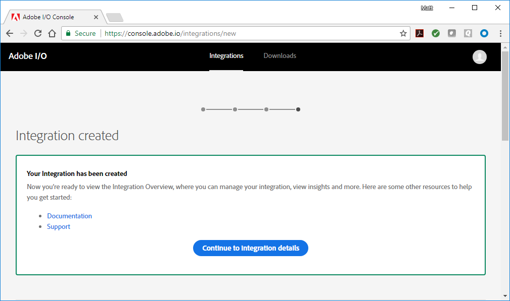
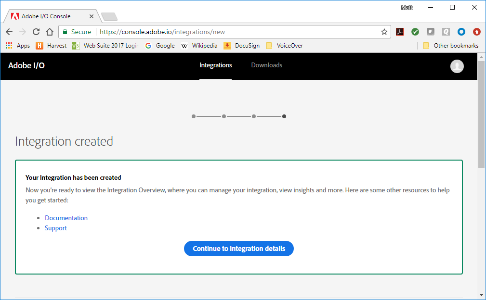
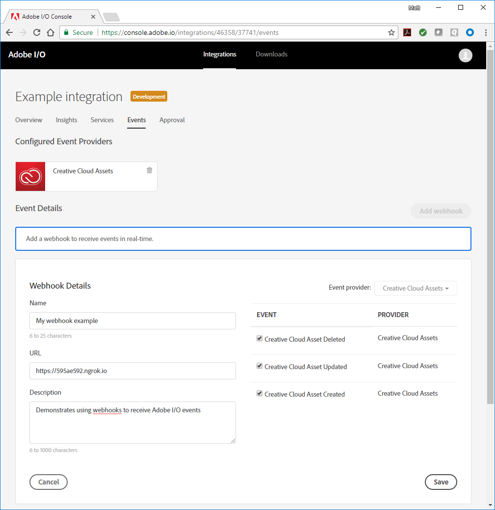
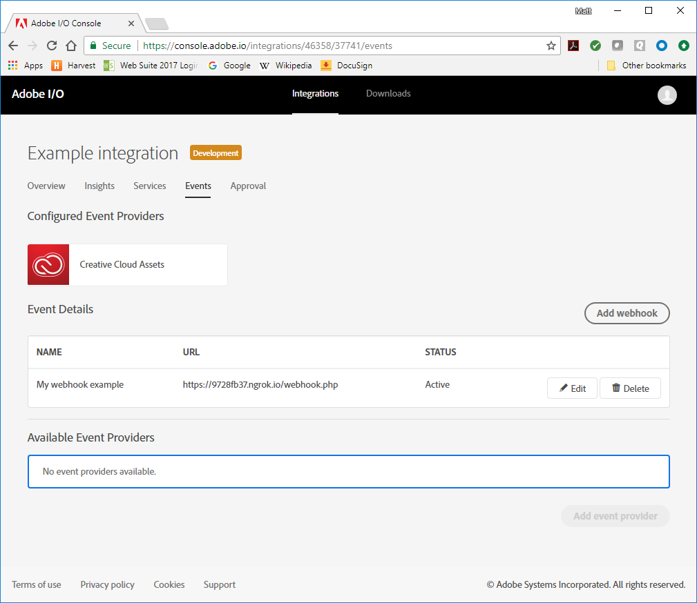

nav_order = 1

# Introduction to Adobe I/O Events Webhooks

- [Introduction](#org3786b01)
- [Concepts](#org81068e4)
  - [An example:](#org07fb732)
- [Your first webhook](#orgbb36f22)
  - [The Challenge Request](#orgec22b7a)
  - [Testing with ngrok](#org1762841)
- [Create an Integration](#org926a538)
- [Registering the Webhook](#orgef08b06)
- [Receiving Events](#orgecb4ae5)


<a id="org3786b01"></a>

## Introduction

With Adobe I/O Events webhooks, your application can sign up to be notified whenever certain events occur. For example, when a user uploads a file to Adobe Creative Cloud Assets, this action generates an event. With the right webhook in place, your application is instantly notified that this event happened.

To start receiving events, you register a webhook, specifying a webhook URL and the types of events you want to receive. Each event will result in a HTTP request to the given URL, notifying your application.


<a id="org81068e4"></a>

## Concepts

An **Event** is a JSON object that describes something that happened. 

Events originate from **Event Providers**. Each event provider publishes specific types of events, identified by an **Event Code**.

A **Webhook URL** receives event JSON objects as HTTP POST requests.

You start receiving events by creating a **Webhook Registration**, providing a name, description, webhook URL, and a list of event types you are interested in.


<a id="org07fb732"></a>

### An example:

Acme Inc. wants to be notified when a new file is uploaded to Adobe Creative Cloud Assets, so it creates the following webhook registration:

```json
{
  "name": "Acme Webhook",
  "description": "Listen for newly created files",
  "webhook_url": "https://acme.example.com/webhook",
  "events_of_interest": [
    {"provider": "ccstorage", "event_code": "asset_created"}
  ]
}
```

Now when a file is uploaded, Adobe I/O Events performs the following HTTP request:

```json
POST https://acme.example.com/webhook HTTP/1.1
Content-type: application/json

{
  "id":"f9218f73-feaa-425f-11111-4940b77fb7d4",
  "category":"asset",
  "source":"creative-cloud",
  "asset":{
    "type":"asset_created",
    "url":"https://cc-api-storage.adobe.io/id/urn:aaid:sc:eu:f7f4c7b9-9216-4f23-a41e-111111111111",
    "filename":"cat.png",
    "pathname":"/files/cat.png",
    "asset_id":"urn:aaid:sc:eu:f7f4c7b9-9216-4f23-a41e-185cc2e1e2b3",
    "user_id":"ABC123@AdobeID",
    "mime_type":"image/png"
  },
  "created_at":"2017-05-08T17:34:59.683Z"
}
```


<a id="orgbb36f22"></a>

## Your first webhook

Before you can register a webhook, the webhook needs to be online and operational. If not then the registration will fail. So you need to take care of setting that up first.

Your webhook needs to

-   be accessible from the internet (localhost won't work)
-   be reachable over HTTPS
-   correctly respond to a "challenge" request


<a id="orgec22b7a"></a>

### The challenge request

When registering a webhook, Adobe I/O Events will first try to verify that the URL is valid. To do this, it sends an HTTP GET request, with a `challenge` query parameter. The webhook should respond with a body containing the value of the `challenge` query parameter.

```
GET https://acme.example.com?challenge=8ec8d794-e0ab-42df-9017-e3dada8e84f7
```

#### Response

You can either respond by placing the challenge value directly in the response body

```restclient
HTTP/1.1 200 OK

8ec8d794-e0ab-42df-9017-e3dada8e84f7
```

or by responding with a JSON object, including the correct `Content-Type` header

```restclient
HTTP/1.1 200 OK
Content-type: application/json

{"challenge":"8ec8d794-e0ab-42df-9017-e3dada8e84f7"}
```
**Note:** Make sure your response is given in the correct content-type. If your webhook script places the challenge value directly in the response body, make sure it's returned as plain text (`text/plain`). For a JSON response, make sure it's `application/json`. Returning a response in the incorrect content-type may cause extraneous code to be returned, which will not validate with Adobe I/O Events.

<a id="org1762841"></a>

### Testing with ngrok
[Ngrok](https://ngrok.com/) is a utility for enabling secure introspectable tunnels to your localhost. With ngrok, you can securely expose a local web server to the internet and run your own personal web services from your own machine, safely encrypted behind your local NAT or firewall. With ngrok, you can iterate quickly without redeploying your app or affecting your customers. 

Among other things, ngrok is a great tool for testing webhooks. Once you've downloaded and installed [ngrok](https://ngrok.com/), you run it from a command line, specifying the protocol and port you want to monitor:
```ngrok http 80```


In the ngrok UI, you can see the URL for viewing the ngrok logs, labeled "Web Interface", plus the public-facing URLs ngrok generates to forward HTTP and HTTPS traffic to your localhost. You can use either of those public-facing URLs to register your Webhook with Adobe I/O, so long as your application is configured to respond on your localhost accordingly. Once your testing phase is complete, replace the ngrok URL in your Adobe I/O integration with the public URL for your deployed app.

<a id="org926a538"></a>

## Creating an integration

To create an integration:

1. Open the [Adobe I/O Console](http://console.adobe.io/); by default, you should be on the Integrations panel. If not, select it from the top menu.  
  
    
  
2. Select [New integration](https://console.adobe.io/integrations/new). You have the choice between "Access an API" or "Receive near real-time events". Choose "Receive near real-time events" and select "Continue".  
  
    
  
3. Now you're given the choice of Adobe event provider for your integration. Choose "Creative Cloud Assets" and select "Continue".  
  
    
  
4. Now you can choose between creating a brand new integration, or updating an existing one. Choose to create a new integration.  
  
    
  
5. Enter a name and description for the integration. As a platform, choose "Web". You also need to specifiy a default redirect URI and redirect URI pattern. These are only relevant when using the [Creative Cloud SDK User Auth UI](https://creativesdk.adobe.com/docs/web/#/articles/userauthui/index.html). For now you can fill in `https://example.com` and `https://example\.com/.*` respectively.  
  
    

<a id="orgef08b06"></a>

## Registering the webhook

To complete the integration, you need to add a webhook. 

1. Select "Add a webhook". The dialog expands to display the webhook details.  

2. Give the webhook a name and description. As the webhook URL, fill in the URL provided by ngrok, but change the protocol to `https`; for example,  `https://595ae592.ngrok.io`. Also, check the boxes for the three available event types: Creative Cloud Asset Deleted, Updated, and Created.  
  
    

3. Select "Save", complete the Captcha ("I'm not a robot"), and then select "Create integration". You should see an acknowledgement that your integration has been created. 
  
    

4. Check the ngrok log. You should see a `GET` request, including the `challenge` that was passed along in the URL.  
  
    

5. Return to the Adobe I/O Console. Select "Continue to integration details" and you'll be shown the Integration Overview. This is where you can see all your integration details and make updates as needed.  
  
    

6. Select the Events tab. Your webhook should be listed as "Active".    
  
   

<a id="orgecb4ae5"></a>

## Receiving events

Log in to [Creative Cloud Assets (<https://assets.adobe.com>)](https://assets.adobe.com). Use the same Adobe ID as the one you used in the Adobe I/O Console.

The webhook you created through the Adobe I/O Console uses your own credentials, and so only receives events related to your Adobe ID. In a real-world application, you would use the credentials of an authenticated user to register a webhook through the API. This way you will receive events related to that user.

Now upload a file and check the ngrok logs again. If all went well, then an `asset_created` event was just delivered to your webhook.
