<!--:navorder:1-->

# Setting up AEM Events with Adobe I/O Events

These instructions describe how to set up Adobe Experience Manager (AEM) for Adobe I/O Events. You can use Adobe I/O for notification of AEM events, such as page or asset changes.

- [Introduction](#introduction)  
- [Set up products](#setupproducts)  
- [Use Adobe I/O](#useadobeio)  
- [Watch the solution work](#watchthesolutionwork)

**Resources**
- [Debugging](../help/debug.md)
- [FAQ](../help/faq.md)
<!-- - [Debugging](../help/debug.md#aemevents) This will work eventually, check DEVEP bugs-->
<!-- - [FAQ](../help/faq.md#aemevents) This will work eventually, check DEVEP bugs -->

## Introduction

Before setting up and using AEM with Adobe I/O, you will need to do the following:

1. [Obtain authorization](#obtainauthorization)
2. [Register an AEM event consumer app](#registeranaemeventconsumerapp)

### Obtain authorization

To complete this solution, you will need authorization to use the following services:

*   An AEM instance, version 6.2.x, 6.3.x or 6.4.x, with administrative permissions. (**Note:** AEM screens in this topic are captured from version 6.3.)
*   [Adobe I/O Console](https://adobe.io/console) access, with administrative permissions for your enterprise organization. 


### Register an AEM event consumer app

You will need to register an AEM event consumer app, such as a webhook, to see responses to AEM changes. 
These instructions include steps for setting up a webhook that is able to accept 
and reply to a [challenge HTTP request](../intro/webhook_docs_intro.md##thechallengerequest) parameter sent by Adobe I/O Events. 
For more information on understanding and working with webhooks, 
see the [Introduction to Adobe I/O Events Webhooks](../intro/webhook_docs_intro.md).

## Set up products

To set up AEM for Adobe I/O Events:

1. [Install the AEM event proxy package](#installtheaemeventproxypackage)
2. [Configure OAuth and IMS authentication](#configureoauthandimsauthentication)

### Install the AEM event proxy package

To install the AEM event proxy package:

1. Download the latest version of the package
   * [version 6.3.14](https://github.com/adobeio/adobeio-documentation/files/2119428/aem-event-proxy-6.3.14.zip) for AEM `6.2.xx` and `6.3.xx` 
   * [version 6.4.255](https://github.com/adobeio/adobeio-documentation/files/2119312/aem-event-proxy-6.4.255.zip) for AEM `6.4.xx`

2. Open AEM Package Manager by selecting the **Tools** icon and then selecting **Deployment** and **Packages**.

   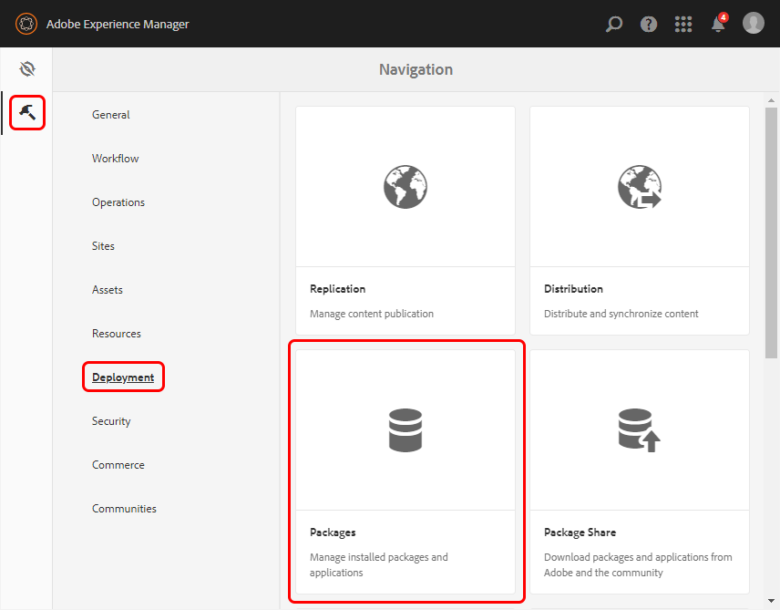

3. In **Package Manager**, select **Upload Package**. Select **Browse** and navigate to the package zip file. Select **OK**.

      >Note: If you have an older version of the package, delete it to avoid potential conflicts. You can delete it from the following location: **crx/de/index.jsp#/apps/eventproxy/install**.

4. Select **Install**.

      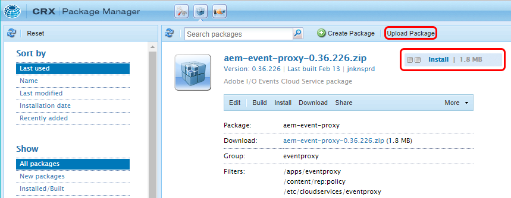

5. On the **Install Package** dialog box, select **Merge** from the **Access Control Handling** drop-down list and select **Install**.

      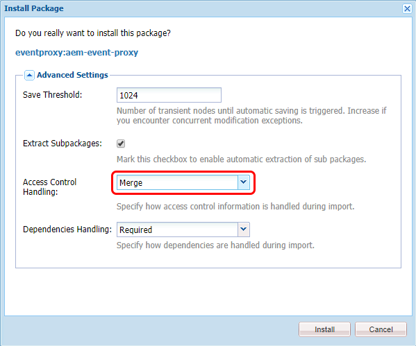

6. Watch the **Activity Log**. If installed, the log reports that the package is imported.

      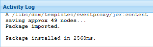

For more information on installing packages in AEM, see [How to Work with Packages](https://helpx.adobe.com/experience-manager/6-3/sites/administering/using/package-manager.html).

#### Additional package installation notes:

1. If you are upgrading the package, delete the previous .jar file from the following location: **`/apps/eventproxy/install`**

2. Verify that the Access Control Handling is properly applied by checking permissions for the `eventproxy-service` user at **/useradmin**. 
If applied correctly, the `eventproxy-service` user is added to the following:

      *   **`/home/users/system/eventproxy/eventproxy-service` with `jcr:read` and `rep:write` authorizations**
      *   **`/content` with `jcr:read` authorization**
      *   **`/etc/cloudservices/eventproxy` with `jcr:read` and `rep:write` authorizations** (for AEM versions prior to 6.4.0)
      *   **`/var/eventproxy` with `jcr:read` and `rep:write` authorizations** (for AEM 6.4.0 and beyond)
                  

For more information, see AEM [User, Group and Access Rights Administration](https://helpx.adobe.com/experience-manager/6-3/sites/administering/using/user-group-ac-admin.html).

### Configure OAuth and IMS authentication

To configure OAuth and IMS authentication:

1. [Create a certificate and keystore](#createacertificateandkeystore)
2. [Add the keystore to the AEM eventproxy-service user group](#addthekeystoretotheaemeventproxyserviceusergroup)
3. [Configure the AEM Link Externalizer](#configuretheaemlinkexternalizer)

#### Create a certificate and keystore

To create a certificate and keystore:

1. Create an RSA private/public certificate in OpenSSL with the following command:

      ```
      openssl req -x509 -sha256 -nodes -days 365 -newkey rsa:2048 -keyout private.key -out certificate_pub.crt
      ```

2. Add the private key and signed certificate to a PKCS#12 file with the following command:

      ```
      openssl pkcs12 -keypbe PBE-SHA1-3DES -certpbe PBE-SHA1-3DES -export -in certificate_pub.crt -inkey private.key -out author.pfx -name "author"
      ```
3. When prompted, create an export password and store it for later use.

4. Create a keystore from the generated keys with the following command:

      ```
      cat private.key certificate_pub.crt > private-key-crt
      ```

      >Note: On Windows systems, you may need to concatenate the files manually or provide an alternate command. For more information, see the [OpenSSL manpages](https://www.openssl.org/docs/manpages.html).

5. Set the alias as **eventproxy** and a non-empty keystore password (such as admin), with the following command:

      ```
      openssl pkcs12 -export -in private-key-crt -out keystore.p12 -name eventproxy -noiter -nomaciter
      ```
      >Note: On Windows systems, this command expression may vary. For more information, see the [OpenSSL manpages](https://www.openssl.org/docs/manpages.html).

#### Add the certificate into the AEM `eventproxy-service` user&rquo;s keystore

To add the certificate into the AEM `eventproxy-service` user&rsquo;s keystore:

1. In AEM, open the **User Management** group by selecting the **Tools** icon and then selecting **Security** and **Users.**

      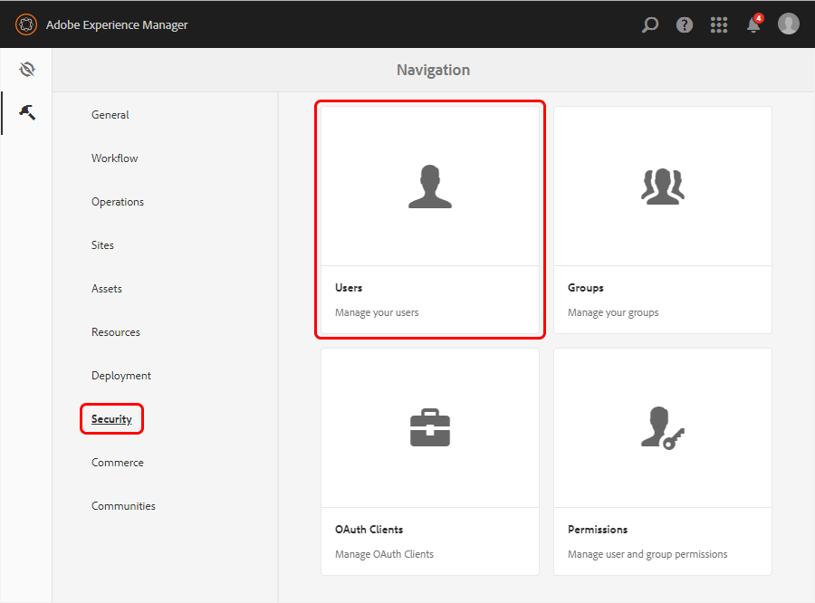

2. Scroll down and Select **eventproxy-service** to open it.

      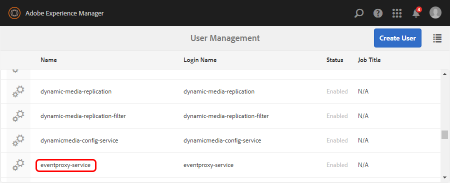
 
3. Select **Create KeyStore**

4. Select **Manage KeyStore** and then expand the section for **Add Private Key from Key Store file.** 

5. Add the keystore.p12 file by setting the key pair alias to **eventproxy** or the alias specified previously. 

6. Provide the keystore password (the same one provided when generating the key store).

7. Provide the private key password and then provide the private key alias **eventproxy**.

8. Select **Submit**.
 
      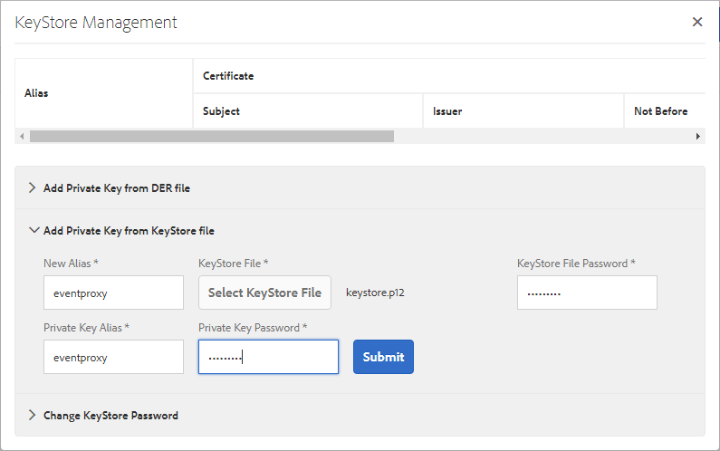

#### Configure the AEM Link Externalizer

To configure AEM Link Externalizer:

1. Open the Web Console, or select the **Tools** icon, then select **Operations** and **Web Console**. 

    The AEM Link Externalizer name can be **author** or any other alias specified in the Adobe Experience Manager Web Console.

    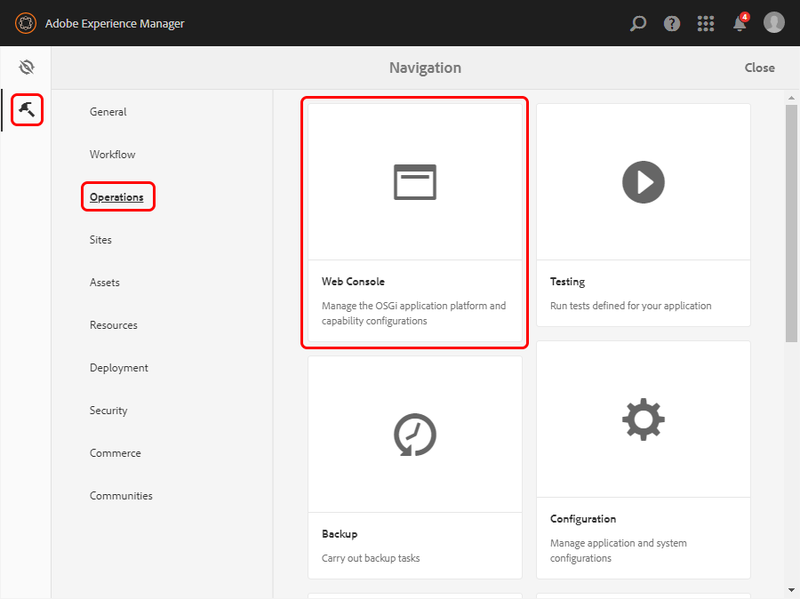

2. Scroll down the list to find **Day CQ Link Externalizer**, update the domain name, and select **Save** when done.
 
    >**Note:** The base URL that you specify appears on the AEM Web Console. Do not use only the word “localhost” as the default name because others may use it. This will then cause confusion and make it difficult to determine which instance is yours. 

    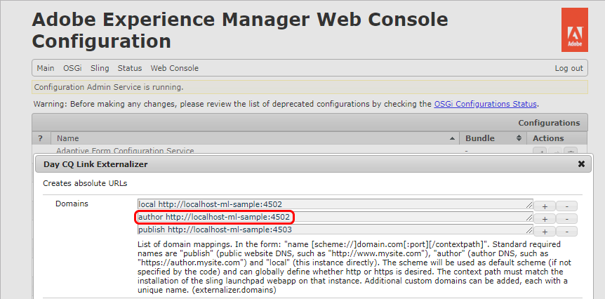

## Use Adobe I/O

Use Adobe I/O to do the following:

1. [Create an Adobe I/O Console integration](#createanadobeioconsoleintegration)
2. [Configure Adobe I/O Events as a cloud service in AEM](#configureadobeioeventsasacloudserviceinaem)
3. [Perform an AEM health and configuration check](#performanaemhealthandconfigurationcheck)
4. [Register the AEM event consumer app](#registertheaemeventconsumerapp)

### Create an Adobe I/O Console integration

To create an [Adobe I/O Console](https://adobe.io/console) integration:

1. After signing in to the Adobe I/O Console, select **New Integration**.

2. Select **Access an API** and then select **Continue**.

      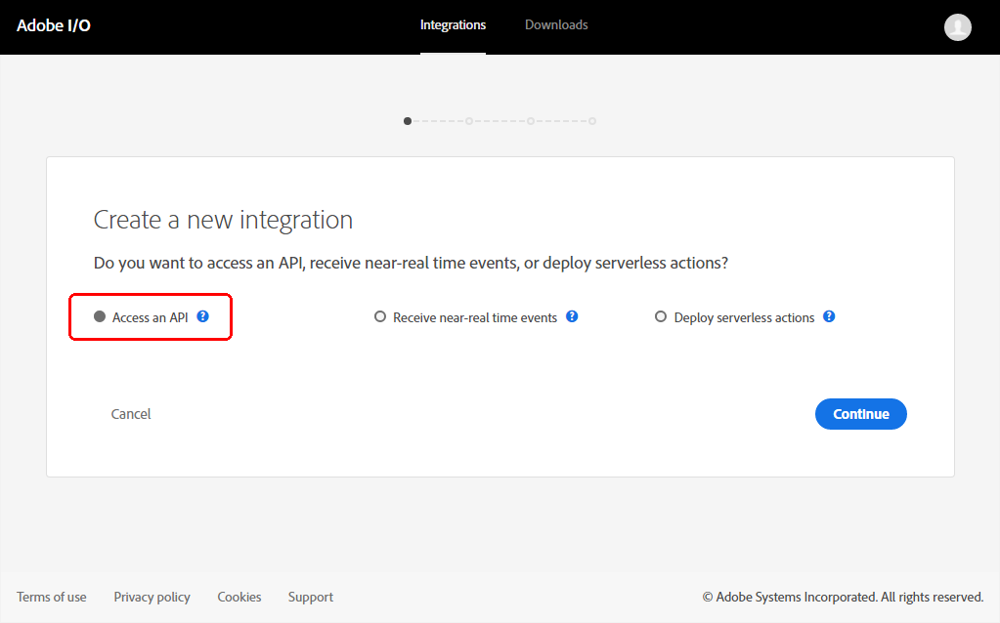

3. On the **Create a new integration** page, select **Adobe I/O Events** and then select **Continue**.

      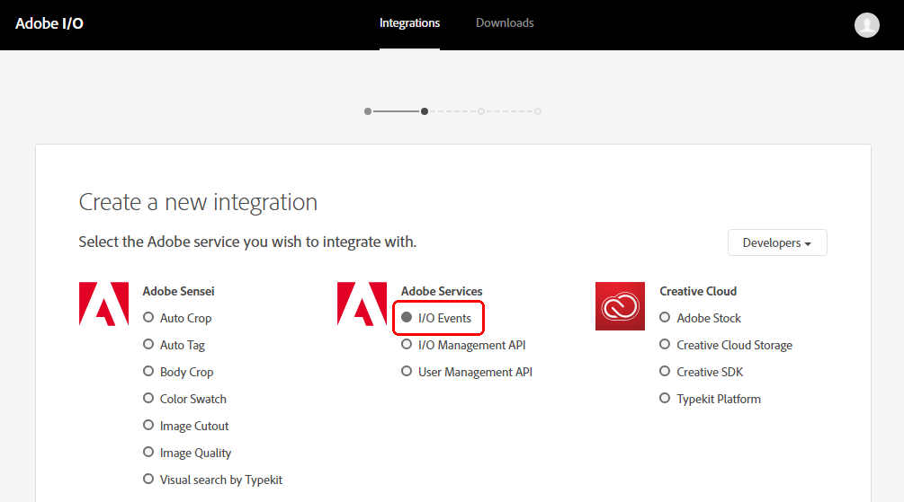

4. Select **New integration**.

      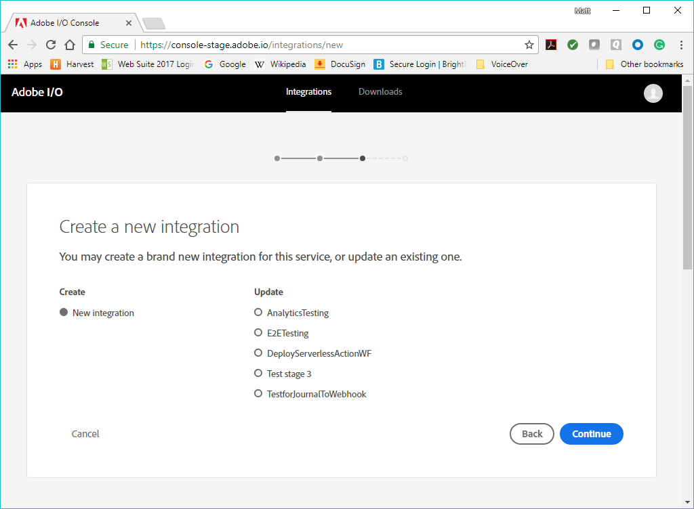

5. In the <strong id="Create-new-integration-box">Create a new integration</strong> dialog box, specify a name for the integration and add a description. To add **Public keys certificates**, select **Select a File** and navigate to your **certificate_pub.crt** to upload it.

      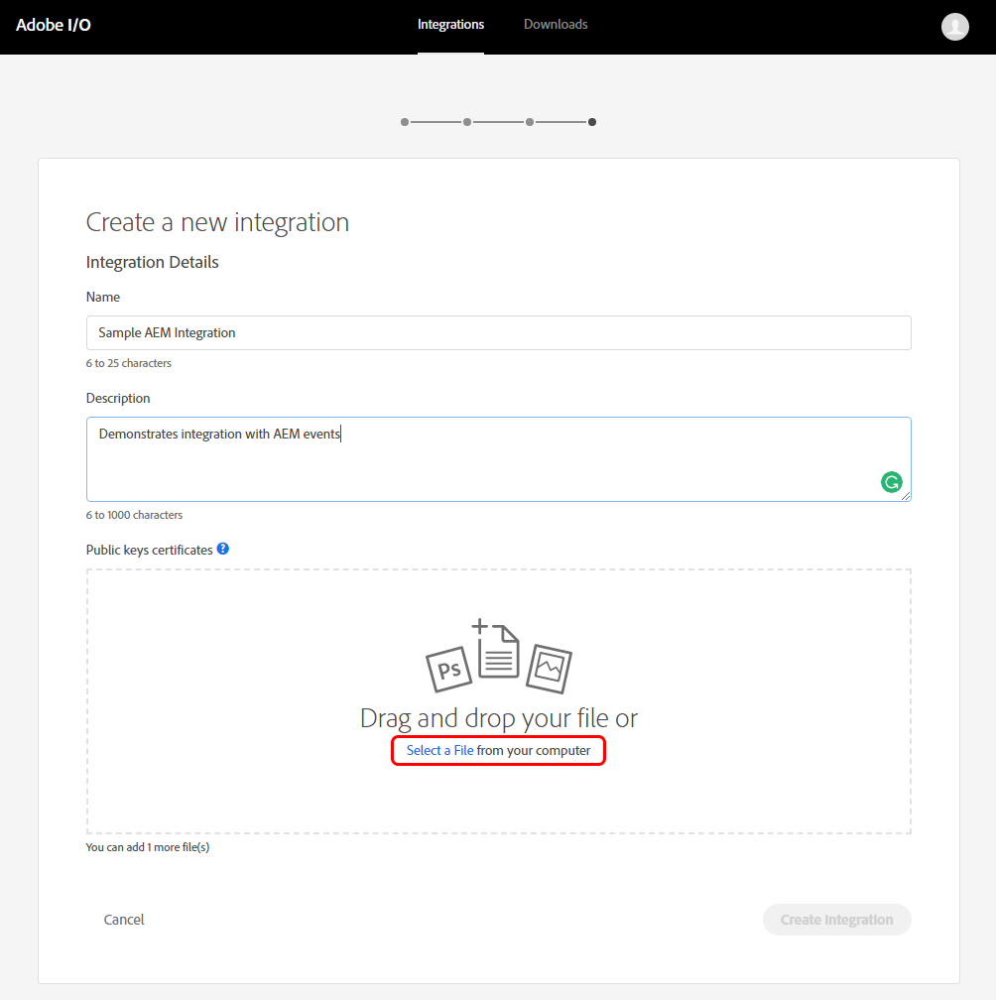

6. Select **Create Integration.**

### AEM Adobe I/O Events configuration

#### AEM 6.4 Configuration

To configure Adobe I/O Events as a cloud service in AEM:

1. Open the Cloud Services console, or select the **Security** icon, and then select **Adobe IMS Configurations**. 

   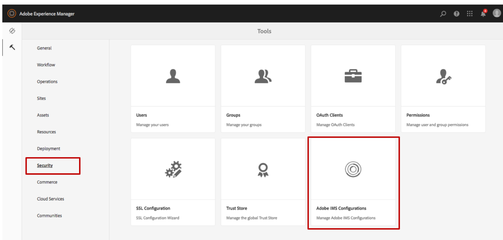
   
2. Click **Create**; 
   **Select `AdobeIOEvents`** in the Cloud Solution drop down; once selected, you should see the certificate you just added to the AEM `eventproxy-service` user's keystore;
   Click **Next** 
   
    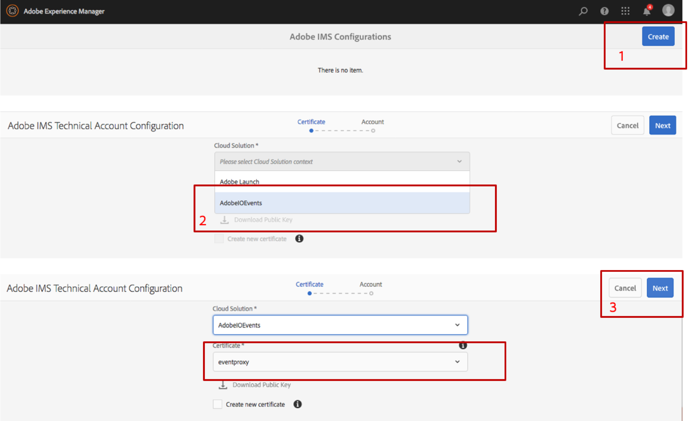

3. Fill in the various entries expected to configure the IMS account associated with the integration 
 you just created in the Adobe I/O Console

*   For **Title**: specify **Adobe IO Events** (or any other title that makes sense to you).
*   For **Authorization Server**: it should be `https://ims-na1.adobelogin.com` (unless the URL shown in the **JWT** tab of your integration page in the Adobe I/O Console is different), 
*   For **API key**: Provide the API key shown in the **Overview** tab of your integration page in the Adobe I/O Console. 
*   For **Technical Account ID**: Provide the Technical Account ID shown in the **Overview** tab of your integration page in the Adobe I/O Console. 
*   For **Client Secret**: Provide the Client Secret shown in the **Overview** tab of your integration page in the Adobe I/O Console. 
*   For **Payload**: Provide the JWT payload shown in the **JWT** tab of your integration page in the Adobe I/O Console.

4. Click **Create**

    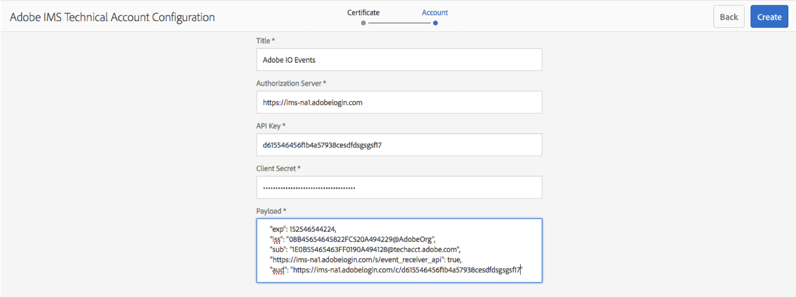
    
6. Now you should see this new Adobe IO Events IMS Configuration, and you can select it to check its health.

     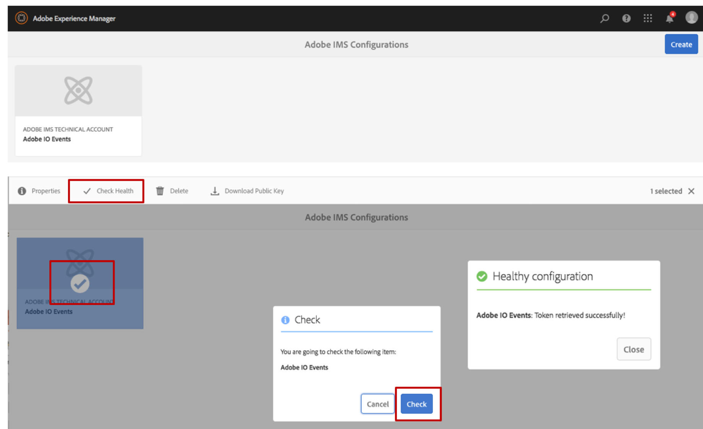


#### AEM 6.2 and AEM 6.3 Configuration

To configure Adobe I/O Events as a cloud service in AEM:

1. Open the Cloud Services console, or select the **Tools** icon, then select **Deployment** and **Cloud Services**. 

      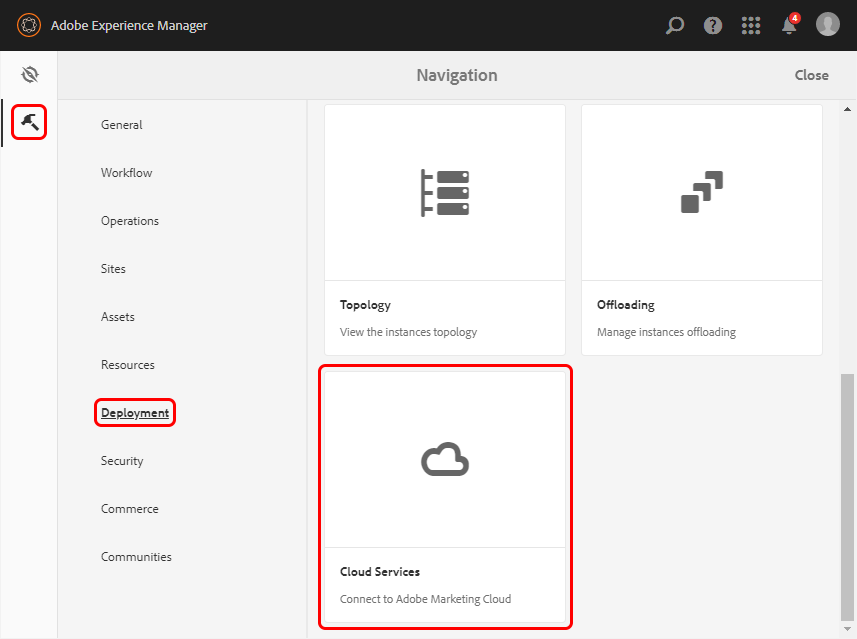

2. Under **Adobe Marketing Cloud** on the **Cloud Services** page, select **Configure now** for **Adobe I/O Events**. 

      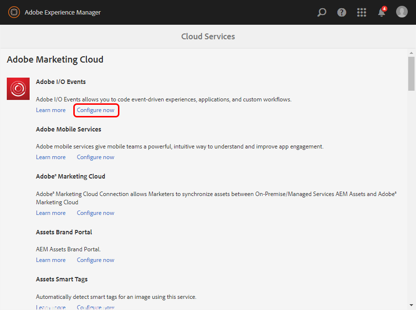

3. In the Create Configuration dialog box, enter a title and a name for your integration, and then select Create.
      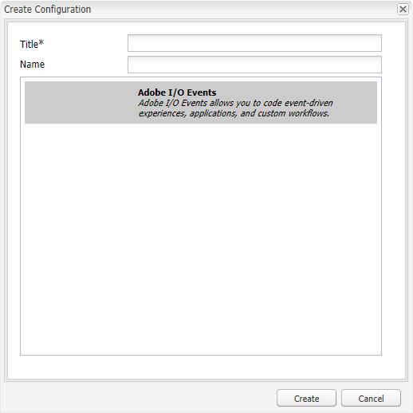

4. Select Edit. Configure the service by specifying each field in the **Edit Component** dialog box. You can copy your credentials from the [Adobe I/O Console](https://adobe.io/console) and paste them into each required field.

      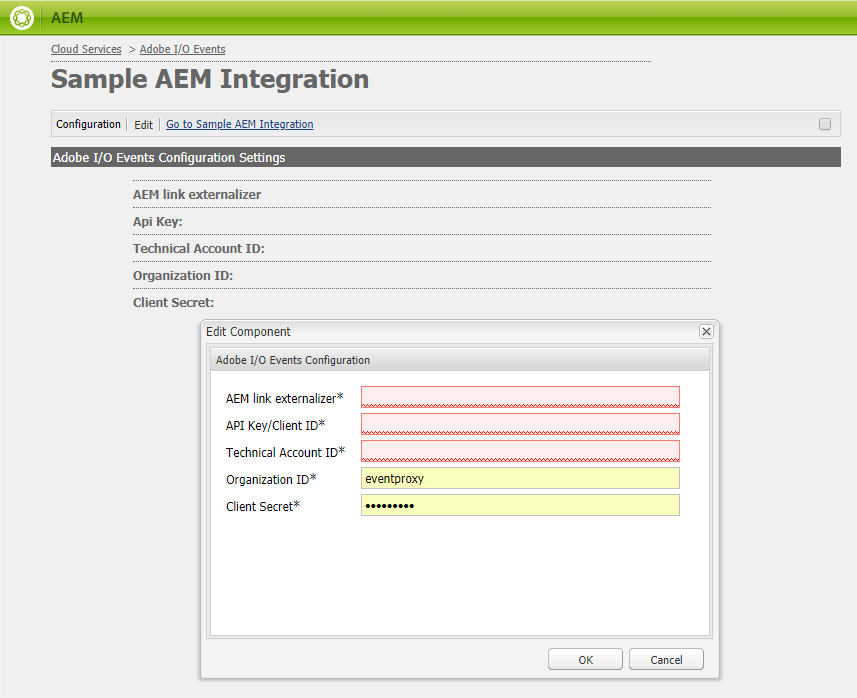

*   For **AEM Link externalizer**: specify **author** (or any other alias previously configured in the AEM Link Externalizer).
*   For **API key**: Provide the key shown on the **Integration Details** page of the Adobe I/O Console. 
*   For **Technical Account ID**: Provide the ID shown on the Adobe I/O Console.
*   For **Organization ID**: Provide the ID shown on the Adobe I/O Console.
*   For **Client Secret**: AEM will automatically retrieve the value from the Adobe I/O Console.


### Register the AEM event consumer app

To register an AEM event consumer app, you can set up a webhook. Your webhook should be able to accept and reply to a challenge HTTP request parameter sent by Adobe I/O CSM.

#### Setting up a webhook: example
To create a webhook at webtask.io, add the following code to make sure the Challenge is echoed back. This is needed for the verification by Adobe I/O CSM when you register the webhook URL later using the CSM API:

```js
var express = require('express');
var Webtask = require('webtask-tools');
var bodyParser = require('body-parser');
var app = express();

app.use(bodyParser.json());
app.get('/webhook', function (req, res) {
   var result = "No challenge";
   if (req.query["challenge"]){
      result = req.query["challenge"]
      console.log("got challenge: " + req.query["challenge"]);
   } else {
      console.log("no challenge")
   }
   res.status(200).send(result)
});

app.post('/webhook', function (req, res) { 
   console.log(req.body)
   res.writeHead(200, { 'Content-Type': 'application/text' });
   res.end("pong");
});

module.exports = Webtask.fromExpress(app);
```

## Watch the solution work 

You can watch the solution work by testing your integration. To do this:

1. [Register your webhook with the Adobe I/O Console](#registeryourwebhookwiththeadobeioconsole)
2. [Perform a webhook health check](#performawebhookhealthcheck)
3. [Optional: Adobe I/O Events OSGI to XDM event mapping configurations](#adobeioeventsosgitoxdmeventmappingconfigurations)

### Register your webhook with the Adobe I/O Console 

Once you have your webhook ready, use the [Adobe I/O Console](https://adobe.io/console) to register it:

1. On the Adobe I/O Console, select **New Integration**.

2. Select **Receive near-real time events** and then select **Continue**.

      

3. Select the AEM Link Externalizer base URL that you [previously specified](#configuretheaemlinkexternalizer) and then select **Continue**.

      

4. Select **Create new integration** and fill in the **Integration Details** form [similar to your previous integration](#Create-new-integration-box).

5. Select **Add webhook** and complete the **Add a new webhook** form.

6. Select the events to which you want to subscribe and select **Save**.

      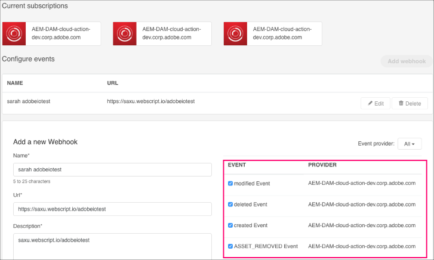

Note: Once you have registered your webhook, responses will include a [status](https://github.com/adobeio/adobeio-events-documentation/blob/master/Webhook_docs_intro.md#org85f36da) field to show if it is ```VERIFIED```.

### Perform a webhook health check

Now you can start testing that your AEM-originated events are emitted by Adobe I/O. 
To do this, first make sure your webhook is subscribed to the type of event you are testing against. 
For asset-related events, create, update or delete an asset in AEM DAM; 
for page-related events, publish or unpublish a page; 
finally, to test our custom OSGI event type sample, you may use our custom OSGI event health check.
    
  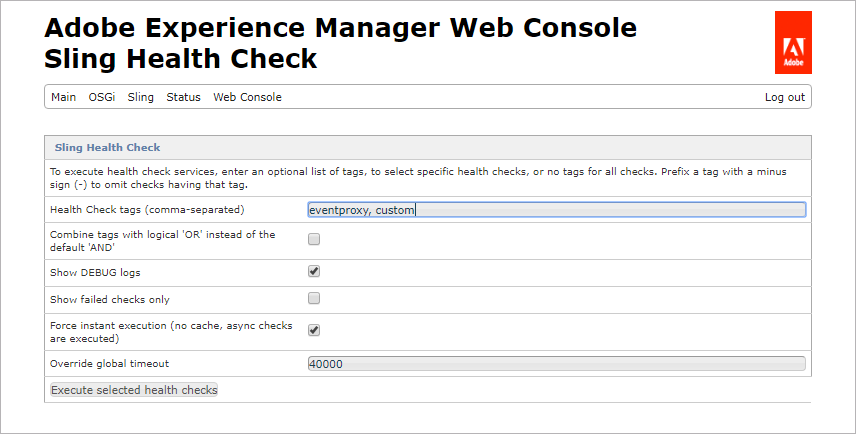

If for some reason, your webhook is failing, note that the Adobe I/O console holds a **Debug Tracing** feature:
It allows you to watch all the events payloads emitted by Adobe I/O towards your webhook and the associated webhook response.
In the console, select your integration, the `Events` Tabulation, your webhook, then `Debug tracing`,
see the screenshot below:

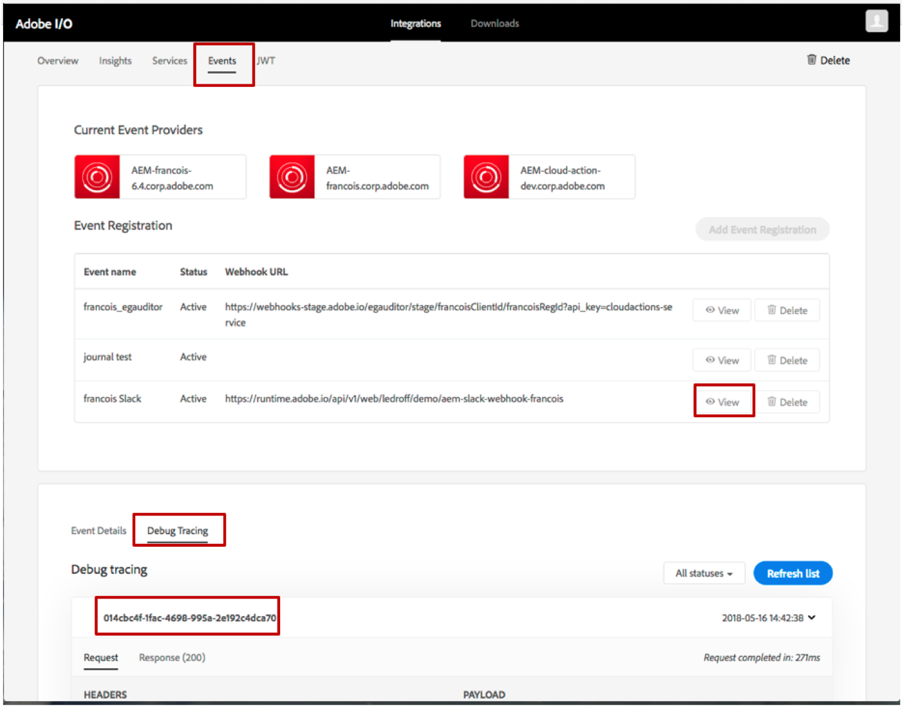

   
<a id="configure-advanced-adobe-i/o-events">&nbsp;</a>

### (Optional)

#### Perform AEM health check

You can use the AEM Web Console Sling Health Check to verify that your configurations are correct.

To verify your configurations:

1. Check that all your configurations load properly by executing the health check tagged with **conf-events**.

      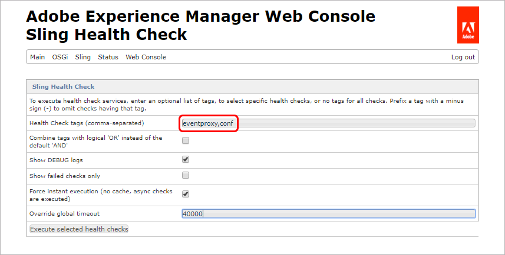

If this health check is failing, check the following:

* Make sure you have the correct event proxy package and update it to the latest version (currently 0.32.226) if needed.
* Verify that when you installed your package, you chose the right install settings.
* Make sure your AEM instance is compatible with Events (must be version 6.2 or higher).
* Check the permissions for your event proxy package.
* Match your I/O Events configuration to the integration that you've created in the Adobe I/O Console.

2. Check that the AEM instance is able to exchange JWT tokens with Adobe I/O Identity Management System (IMS). 
To do this, execute the health check tagged with **ims-events**. 
This verifies that your IMS-related configurations are correct and working, 
including the `eventproxy-service` user keystore configuration, the Adobe I/O console&ndash;originated API key, the Technical Account ID, 
the Organization ID, and the client secret.

      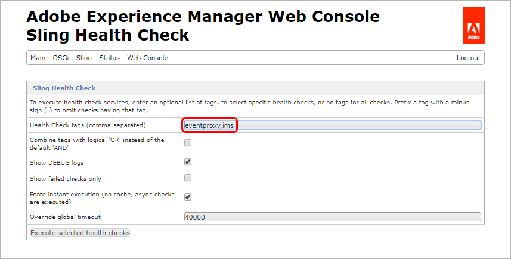

If this health check is failing, check the following:

* Match your I/O Events configuration to the integration that you've created in Adobe I/O Console.
* Make sure that the keystore you've uploaded matches the public certificate in your integration.


3. Check that the event metadata and the provider associated with the AEM instance are registered in Adobe I/O Channel & Subscription Management (CSM) by executing the health check tagged with **csm-events**.
This verifies that the AEM instance is successfully registered as an event provider with Adobe I/O CSM.

      

#### Adobe I/O Events OSGI to XDM event mapping configurations

For all Adobe I/O event types defined by the Adobe I/O Event Model, there is an **Adobe I/O Events OSGI to XDM event mapping configuration**.

For each of these you can edit:

* The OSGI Topic you want to observe: `osgiTopic`
* The OSGI Filter you want to apply in your OSGI event observation. If left empty no osgi filtering is done: `osgiFilter`
* The JCR `osgiJcrPathFilter` to filter the OSGI events further. If left empty, no resource path filtering is done: `osgiJcrPathFilter`
* The OSGI Event Handler Type (use the default `com.day.cq.dam.eventproxy.service.impl.listener.AdobeIoEventHandler` to map any custom OSGI event): `osgiEventHandlerClassName`
* The Adobe I/O XDM Event Type to map to the OSGI event: again, use the default (`com.adobe.xdm.event.OsgiEmittedEvent`) to map your custom OSGI events: `adobeIoXdmEventClassName`
* The Adobe I/O Event Code (unique to your event provider; in other words, unique to your AEM instance/cluster): `adobeIoEventCode`
* The Adobe I/O Event Label as it will appear on the Adobe I/O Console: `adobeIoEventLabel`
  
The various OSGI event handlers will intercept the events according to these values and then map these OSGI events to the Adobe I/O Event Model before forwarding them to Adobe I/O.

The solution leverages the OSGI configuration factory pattern; hence you can not only edit these configurations, but you can also remove and add such configurations.

To configure using the panel:

1. Select **Tools** in AEM and then select **Operations** and **Web Console**.

      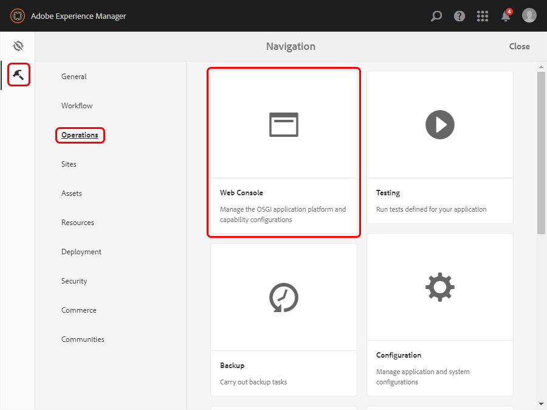

2. In the **OSGI** menu, select **Configuration**.

      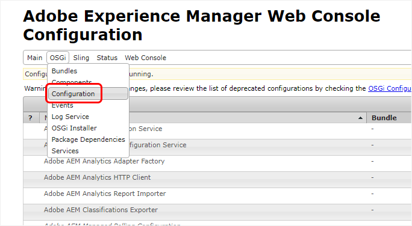  
      and search for: **Adobe I/O Events CSM Registration**.

3. For **Adobe I/O Events OSGI to XDM Event Mapping Configuration**, select **+**, **Edit**, or **Delete**.


#### Adobe I/O Events queuing and retries

When an OSGI event of interest is triggered (i.e an OSGI events that matches one of your `OSGI to XDM event mapping configurations`), it makes it to a job queue handled by `Sling Job Handler`.

This job is persisted in the resource tree (for failover etc.), then the job is distributed to an instance responsible for processing the job; and on that instance the job is put into a processing queue, where eventually a `Sling Job Consumer` will execute it.

Adobe I/O Events `Sling Job Consumer`'s job is to send this event to Adobe I/O.
* `JobResult.OK` should be returned. If the job has not been processed completely, 
* `JobResult.FAILED` should be returned if Adobe I/O fails either to receive or to process it (due to network failure or Adobe I/O failure).
In that case the job will be rescheduled/retried   
* if the max number of retries is met, the process will not be rescheduled and treated like the method would have returned `JobResult.CANCEL`.

Note that 
* Adobe I/O Events `Sling Job Consumer` topic is `com/adobe/eventproxy/events`
* Adobe I/O Events `Sling Job Queue configuration` is the default `Apache Sling Job Default Queue` with
  * a Normal job priority
  * 10 maximum retries
  * 2 seconds retry delay
  * 15 maximum parallel jobs
    

You can tune this configuration according to your needs: using the `OSGI > configuration` menu of AEM's `system console`
and create there a new `Apache Sling Job Queue Configuration`


  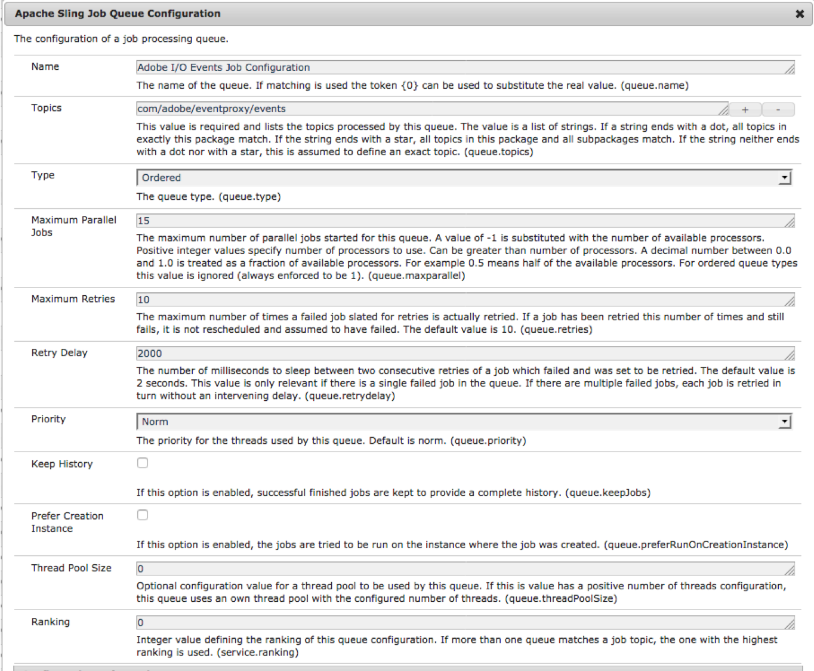

Note that you can use the `Sling > Jobs`  menu of AEM `system console`, 
to look up the statistics and health of your queues

 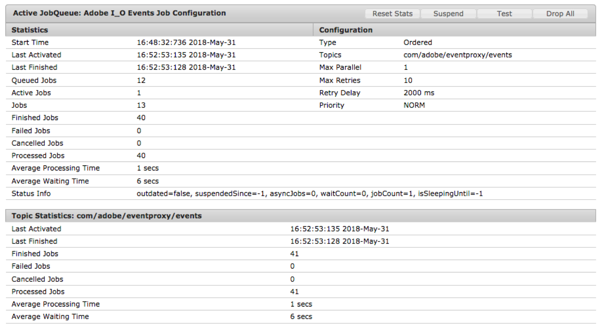


Please refer to the Sling documentation:
* https://sling.apache.org/apidocs/sling7/org/apache/sling/event/jobs/consumer/JobConsumer.html
* https://sling.apache.org/documentation/bundles/apache-sling-eventing-and-job-handling.html


## Authors

- Sarah Xu [@sarahxxu](https://github.com/sarahxxu).
- John Wight [@johnwight](https://github.com/johnwight).

## Feedback?

Please help make this solution as useful as possible. If you find a problem in the documentation or have a suggestion, select the **Issues** tab on this GitHub repository and then select **New issue**. Provide a title and description for your comment and then select  **Submit new issue**.

   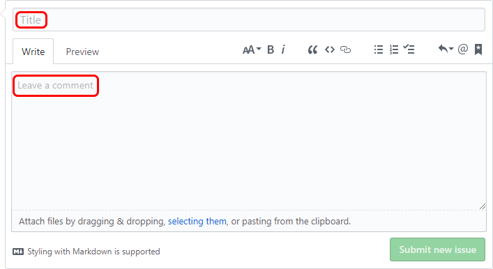
