<!--:navorder: 2-->

# Integrate Analytics Triggers with Adobe I/O Events

These instructions describe how to use Adobe Analytics triggers to notify you of Adobe I/O events, including the behavior of your site&rsquo;s users. Follow the instructions below to try the solution yourself.

- [Introduction](#introduction)
- [Set up products](#setupproducts)
- [Use Adobe I/O](#useadobeio)
- [Watch the solution work](#watchitwork)

**Resources**
- [Debugging](help/debug#analyticstriggersevents)
- [FAQ](help/faq#analyticstriggersevents)

## Introduction

### What are Triggers?
Triggers is a Marketing Cloud Activation core service that enables marketers to identify, define, and monitor key consumer behaviors, and then generate cross-solution communication to re-engage visitors.
For more information on triggers, see the [Triggers Help Page](https://marketing.adobe.com/resources/help/en_US/mcloud/triggers.html).


Before setting up and using Adobe I/O, you will need to do the following:

1. [Obtain product authorization](#obtainproductauthorization)
2. [Obtain administrative permissions](#obtainadministrativepermissions)

### Obtain product authorization

To complete this solution, you will need authorization to use the following services:
*   Adobe Analytics, including Triggers
*	Adobe Marketing Cloud Activation Core Services
*   Adobe Experience Manager (AEM), or an external website that connects to Analytics
*   An [Adobe ID](https://helpx.adobe.com/x-productkb/global/adobe-id-account-change.html), if you do not have one already

### Obtain administrative permissions

You will also need administrative permissions for the following:
* Adobe Analytics
* Your enterprise organization
* AEM, if using that service to connect to Analytics

If you do not have administrative permissions, please contact ioevents-beta@adobe.com. After requesting administrative permissions, watch for an email from Adobe Systems Incorporated, as shown:

   

## Set up products

To set up Adobe products for this solution:

1. [Set up AEM](#setupaem)
1. [Set up Analytics Triggers](#setupanalyticstriggers)

### Set up AEM

To set up AEM with Analytics Triggers and Dynamic Tag Management (DTM), follow the [step-by-step documentation](https://github.com/johnwight/Adobe-AEM-with-DTM-and-Analytics) for that configuration. You can also follow the video shown below:


   [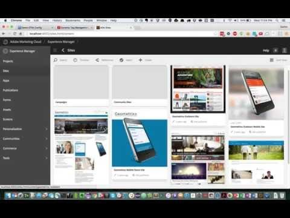](https://youtu.be/vtcZCS-LFeg "Video: Integrate AEM")

### Set up Analytics Triggers

To set up Analytics Triggers:

1. [Get product access through Adobe Admin Console](#getproductaccessthroughadobeadminconsole)
2. [Configure reporting for Triggers](#configurereportingfortriggers)
3. [Configure DTM](#configuredtm)
4. [Specify a new trigger](#specifyanewtrigger)

#### Get product access through Adobe Admin Console	 

To get access through the Adobe Admin Console:

1.	Sign into the console by clicking the **Sign in** button on the administrator rights email you received from Adobe and then providing your credentials.

2.	On the main screen of the Admin Console, select **Products**.

3.	On the Products page of the console, verify that your requested products have been added to the site and then select the **Adobe Analytics** icon.

      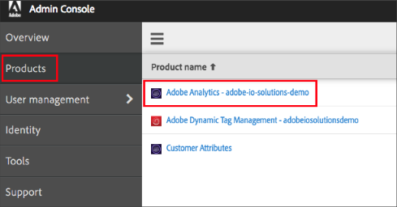

4.	Select the **Configuration Details** tab and do the following:

    1.	Verify the **Name** of your configuration.

    2.	Provide a **Description**, if applicable.

    3.	Verify the display name that will show on the **Products** page.

    4.	Under **Enabled Services**, select the option for **Triggers**.

        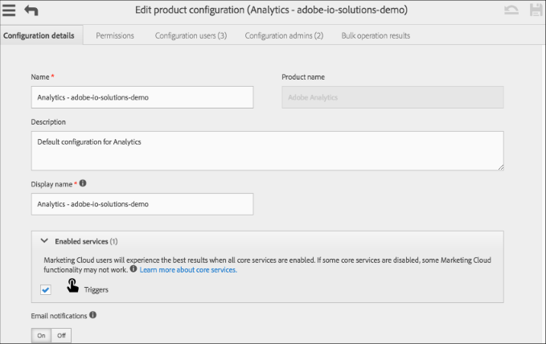

  5. To give permissions to users who want access to Adobe services in the cloud:

     1. Select **User management** and then select **Users**.
     2. Select the user's name.
     
        

     3. For the user's **Access and rights**, provide **Product Access** and **Admin Rights** from the drop-down for the available products and services.
     
        

#### Configure reporting for Triggers

To configure reporting for Triggers:

1. On the Marketing Cloud home page, select the **App** button at the top right corner.

    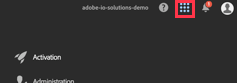

2. Select the Analytics Launcher.

    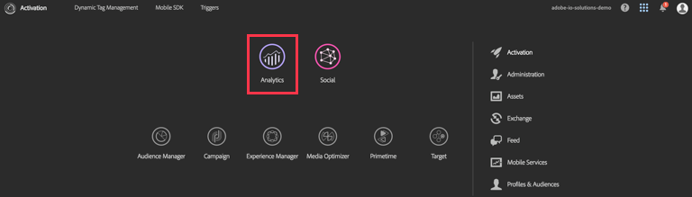

3. On the **Admin** tab of the Analytics home screen, select the **Report Suites** option. (**Note:** You must have administrative privileges for the **Admin** tab to appear on your screen.)

    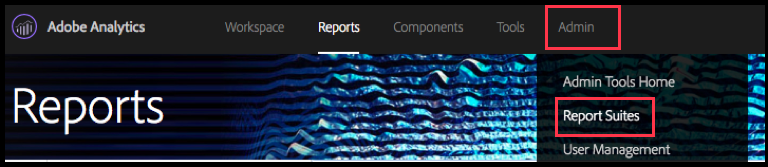

4. On the Reports Suites Manager page, select **Create New** and then select **Report Suite**. Configure the new report suite so that it is accessible in Adobe Analytics.

    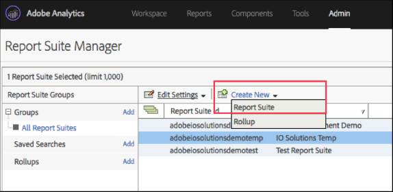

#### Configure DTM

To configure DTM:

1.	On the Marketing Cloud home page, select the **Apps** icon and then select **Activation**.

    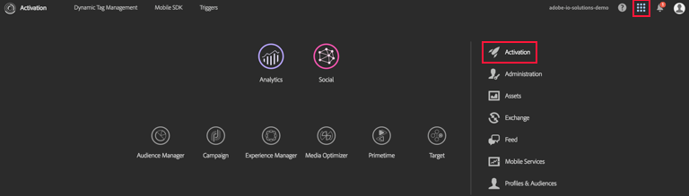

2.	On the Activation page, click **Dynamic Tag Management**.

    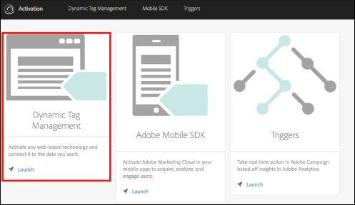

3.	On the **Overview** tab, click the **Settings** icon.

    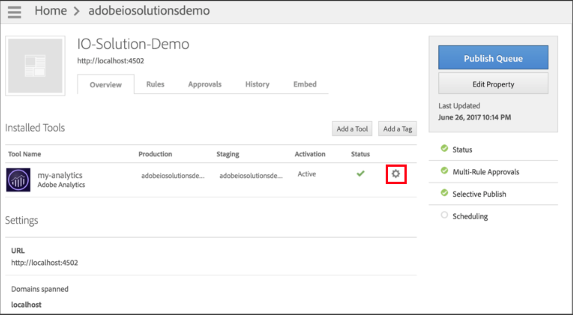

4. On the Settings page, set the variable as follows:

    1. Expand the **Global Variables** section.
    2. Choose the **Evar name** drop-down and then select **eVar3**.
    3. Select the **Set as** option.
    4. In the **Set as** field, type the following URL element:
        ```
        %window.location.host%%window.location.pathname%
        ```
    5. Click **Save eVar**.

        

5. On the **Approvals** tab, select the **Approve** button.    

    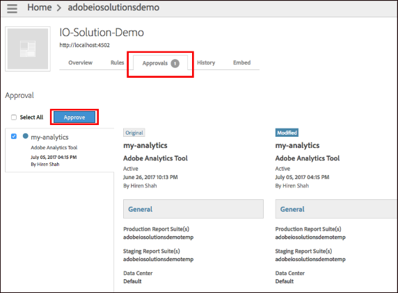

6. On the **Overview** tab, select the **Publish Queue** button.

    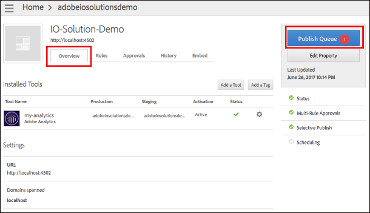

#### Specify a new trigger

You can specify triggers for many events on your site. This example will set notifications to be sent when carts are abandoned: set a trigger for sessions when the user visits either a **cart.html**, **checkout.html** or **order.html** page, but never reaches the **thank-you.html** page within a ten minute session. The trigger indicates that the user added products to the cart, and was about to make a purchase, but later decided otherwise, or forgot to complete the purchase.

To specify a new trigger:

1. On the Marketing Cloud home page, select the **Apps** icon, and then select **Activation**.

    

2. On the Triggers card, select the **Launch** button.
    
    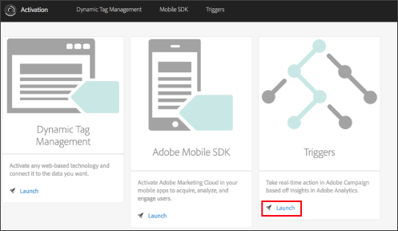

3. On the **Triggers** page, select the **New Triggers** button, and then choose **Abandonment**.

    

4. On the **New Trigger** box, specify a **Name** and provide a **Description** for your trigger. Select the **Report Suite** that you previously setup from the drop-down field.

    

5. On the **Triggers Settings** page, define the business rules for your trigger. You can drag a dimension/metric box from the left panel to the right side of the screen and then specify the business rules for what must happen and what must not happen in a session. In this case, set the trigger to fire after 10 minutes of inactivity after the rules are met.

    

6. Click the **Save** button.

Once you save the trigger, any event in your report suite that meets the defined business rules criteria will cause a trigger to fire. You can view the status of triggers on the **Triggers** page.


## Use Adobe I/O

Use Adobe I/O to create a new integration with the Console. To do this:

1. After signing in to the [Adobe I/O Console](https://adobe.io/console), select **New Integration**.

    

2. Choose **Receive near real-time events** and select **Continue**.

    

3. Choose **Analytics Triggers** as an event provider and click **Continue**.

    

4. Click **Continue** to move on to the next page without making any changes.

5. Provide the **Name** and **Description** for your integration.

    

6. Generate a public certificate. To do this:

    1. Open a terminal and execute the following command:

        `openssl req -x509 -sha256 -nodes -days 365 -newkey rsa:2048 -keyout private.key -out certificate_pub.crt`

    2. Upload the public certificate by clicking the **Select a File** link and then by selecting the certificate from your computer:

        


7. Add Webhook details and Click **Save**. For information on creating and registering webhooks, see [Introduction to Webhooks](https://github.com/adobeio/adobeio-events-documentation/blob/master/Webhook_docs_intro.md).

    

## Watch the solution work

Your enterprise may have its own tool that you can use to subscribe and listen to webhook events. Alternatively, you can use the following procedure to set up notifications with Slack.
To watch your trigger work on Slack:

1. Clone the repository and follow the setup described on https://github.com/hirenshah111/webhook_server.

2. Modify the Slack details in webhook_server/public/javascripts/app.js according to how you want to see the notifications.

3. Run the application and create a **triggers2** listener, then click **Connect**.

    


Trigger messages are received as `POST` requests on this thread.

## Authors
- Hiren Shah [@hirenshah111](https://github.com/hirenshah111).
- John Wight [@johnwight](https://github.com/johnwight).

## Feedback?

Please help make this solution as useful as possible. If you find a problem in the documentation or have a suggestion, click the **Issues** tab on this GiHhub repository and then click the **New issue** button. Provide a title and description for your comment and then click the **Submit new issue** button.


