nav_order = 3

# Setting Up Creative Cloud Asset Events on Adobe I/O Events

These instructions describe how to set up Creative Cloud Asset events using Adobe I/O Events. You can use Adobe I/O for notification of CC Asset events.

- [Introduction](#introduction)  
- [Access events](#access-events)  
- [Create an integration](#create-integration)  
- [Receive events](#receive-events)

## <a id="introduction">Introduction</a>
Creative Cloud Assets provides a simple set of events to which you can subscribe: 
- **asset-updated:** Triggers when an asset is changed or modified.
- **asset-created:** Triggers when a new asset is uploaded to Creative Cloud, or when an asset is _copied_ to a new folder (not when an asset is merely moved).
- **asset-deleted:** Triggers when an asset is _permanently_ deleted from Creative Cloud. Merely archiving an asset does not trigger the event. 

There are no events for the following activities:
- Moving a file from one folder in Creative Cloud to another.
- Renaming a file. This is because assets are tracked in Creative Cloud by GUIDs, and the GUID doesn&rsquo;t change when the file is renamed. Creative Cloud recognizes that the asset hasn&rsquo;t changed, and can still find the asset by the same GUID. Any URL paths you create to that file, however, would change, since they do include the filename.

## <a id="access-events">Access events</a>
Unlike other Cloud Platform event providers, Creative Cloud Assets does not require an enterprise account, or administrative status, to gain access for creating integrations or receiving events. However, the integrations you create will still need to authenticate the same way any other Adobe integrations do. Consider what kind of authentication your integration needs before you start, and follow the correct procedure (see [Adobe Authentication](https://www.adobe.io/apis/cloudplatform/console/authentication/gettingstarted.html)) to get the access rights your integration needs.

> **Note:** Creative Cloud Assets events are currently accessible through a managed beta program. See https://adobeio.typeform.com/to/QvEgPP to apply for access.

## <a id="create-integration">Create an integration</a>
For the purposes of this example, you&rsquo;ll be creating an individual integration using your personal Adobe ID. 

To create an integration for Creative Cloud Assets:

1. Log into [Adobe I/O Console](https://console.adobe.io). You&rsquo;ll see a list of any integrations you&rsquo;ve created so far. If this is your first, you&rsquo;ll see a button for creating an integration.

    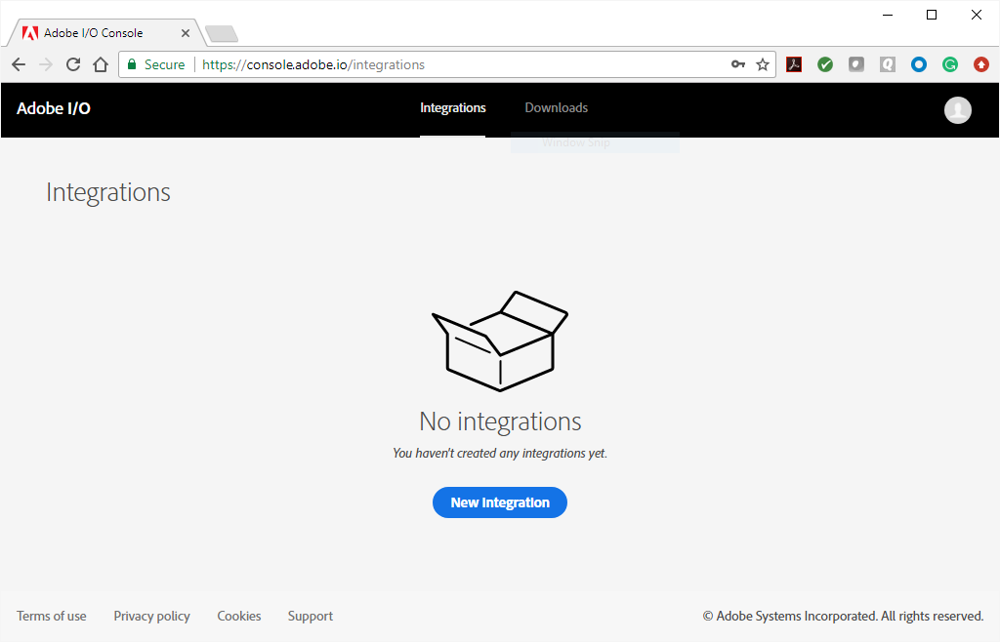  

2. Select &ldquo;New integration&rdquo;. The &ldquo;Create a new integration" screen appears. 

    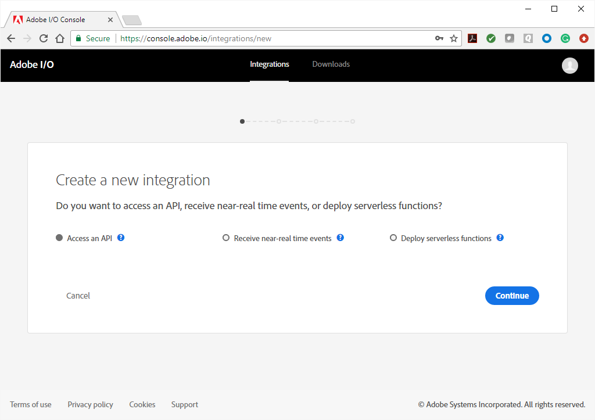

3. Select &ldquo;Receive new real-time events&rdquo; and continue.

4. Select an event provider: Since you&rsquo;re using your personal account, the only provider you&rsquo;ll see is Creative Cloud Assets. Choose &ldquo;Creative Cloud Assets&rdquo; and continue.

    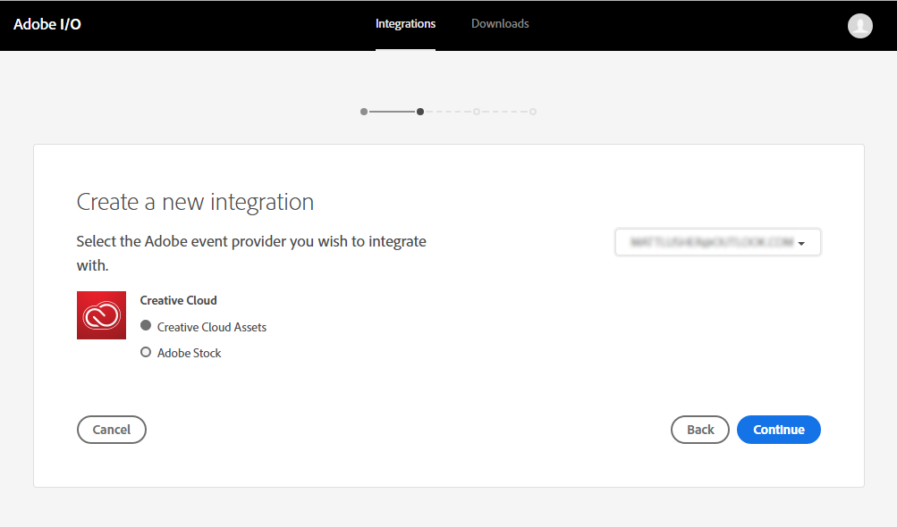

5. You&rsquo;re offered one last chance to update an existing integration, if you have any; select &ldquo;New integration&rdquo; and continue.

    

6. Enter details for the integration. Console needs a name and a description; these can be whatever you want, subject only to length restrictions. Choose &ldquo;Web&rdquo; for the platform and provide a redirect URI and a redirect URI pattern.

    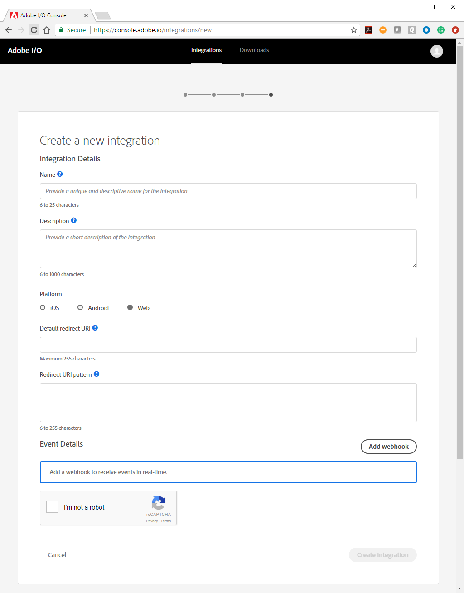

>Note: Your integration needs to send a redirect URI to Adobe when it authenticates on behalf of a user, to send them to your integration once authentication is complete. The redirect URI you provide here is a default, to which Adobe I/O will fall back if the redirect URI in your authentication request fails. The redirect URI pattern is used by Adobe I/O to validate the redirect URI you provide with an authentication request. **All** redirect URIs must use HTTPS.

### Add a webhook
When you select &ldquo;Add webhook&rdquo;, the dialog expands to provide fields for you to define a webhook to receive Adobe Events. (For more on webhooks, see [Adobe I/O Events Webhooks](../intro/webhook_docs_intro.md).) The webhook you ultimately use should be part of the app you develop as your integration. For now, however, it&rsquo;s easy to set up a simple webhook to test your integration&rsquo;s connection with Adobe Events. 

Several tools exist on the web that can be used for this purpose: [ngrok](https://ngrok.com/), [Postman](https://www.getpostman.com/), and [Webtask](https://webtask.io), for example. For this example, use Webtask.

1. Go to https://webtask.io. On the home page, either sign in (if you already have an account) or select &ldquo;Try it now!&rdquo;.

    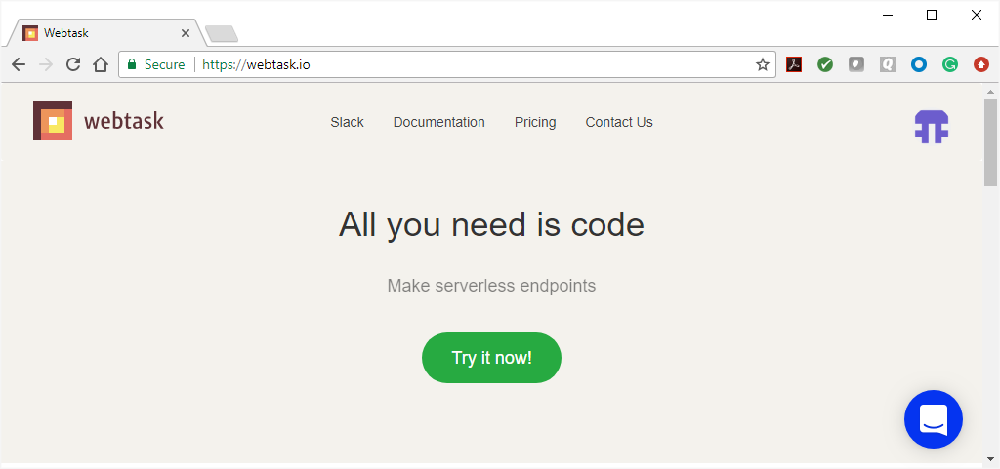

2. You&rsquo;ll be taken to the Webtask web UI. There&rsquo;s also a command-line tool you can install if you choose.

    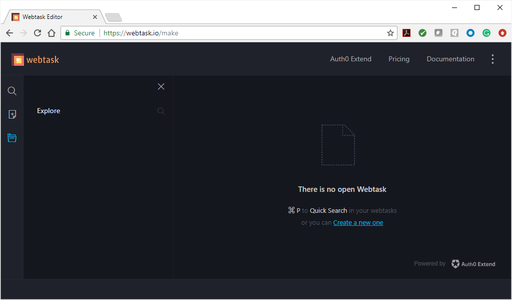

3. Select &ldquo;Create a new one&rdquo;. Once you focus on &ldquo;Webtask Function&rdquo;, the dialog expands to offer you a choice of creating an empty one, or selecting a template. 

    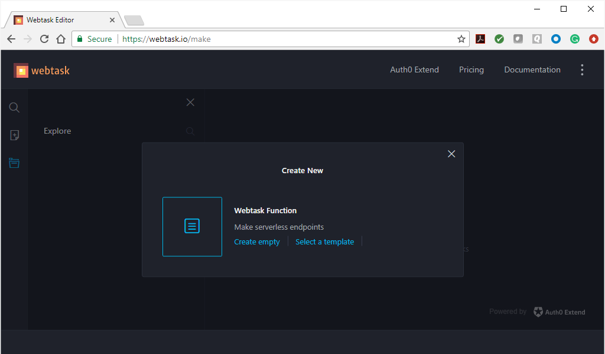

4. Start with an empty one. Give it a name suitable for your integration and select Save. A new webtask opens with the default template in place.

    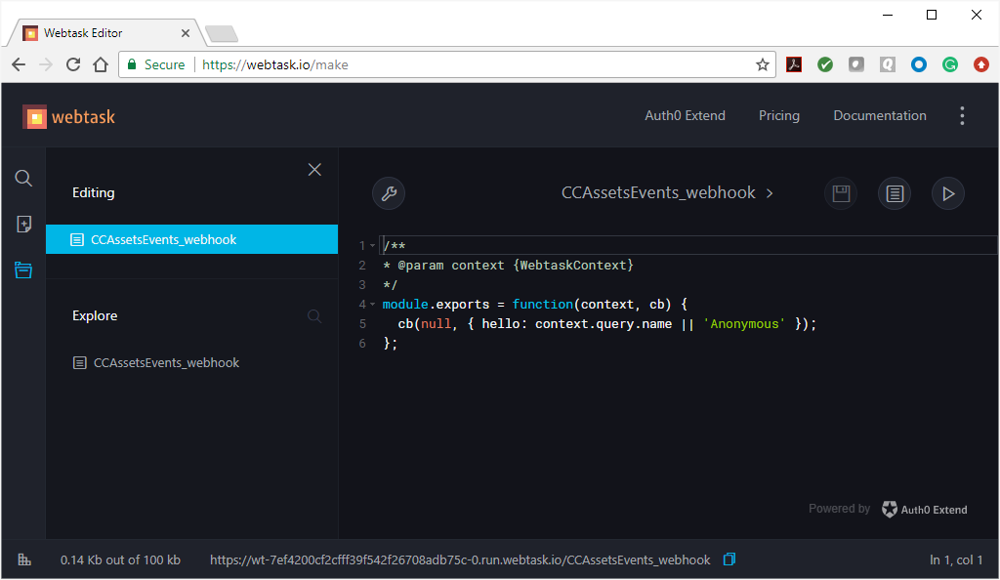

5. Copy and paste this code into the Webtask editor, replacing the default contents, and select Save: 

    ```js
    var express = require('express');
    var Webtask = require('webtask-tools');
    var bodyParser = require('body-parser');
    var app = express();

    app.use(bodyParser.json());
    app.get('/webhook', function (req, res) {
    var result = "No challenge";
    if (req.query["challenge"]){
        result = req.query["challenge"]
        console.log("got challenge: " + req.query["challenge"]);
    } else {
        console.log("no challenge")
    }
    res.status(200).send(result)
    });

    app.post('/webhook', function (req, res) { 
    console.log(req.body)
    res.writeHead(200, { 'Content-Type': 'application/text' });
    res.end("pong");
    });

    module.exports = Webtask.fromExpress(app);
    ```

This simple webhook is designed merely to do what Adobe Events requires: handle an HTTPS GET request containing a `challenge` parameter by returning the value of the challenge parameter itself. 

6. With the code in the Webtask editor, you&rsquo;ll see the URL for your webtask&rsquo;s endpoint at the bottom of your browser window: 

    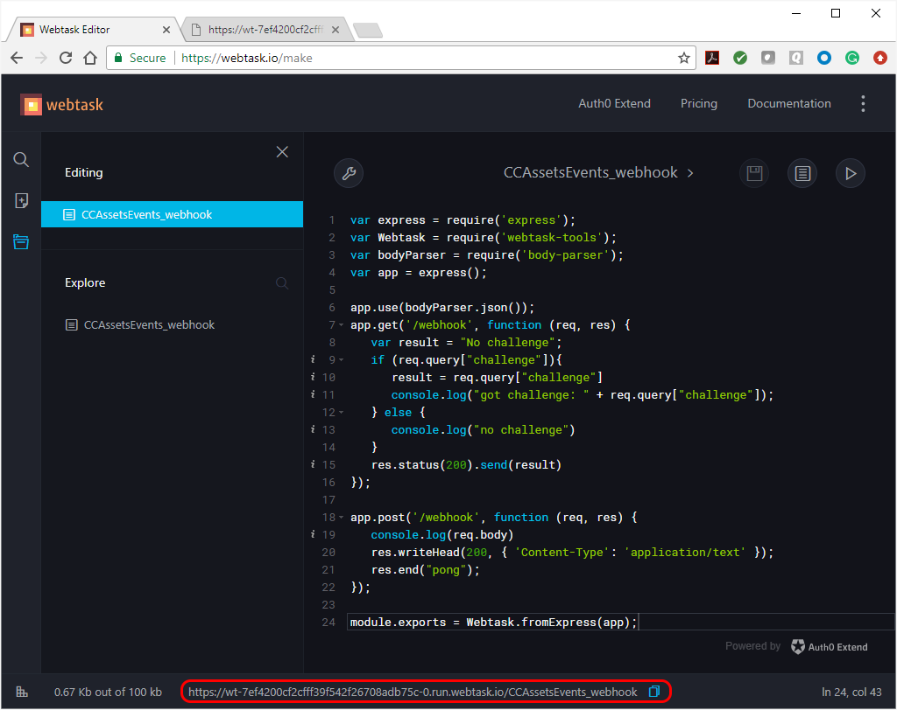

    Notice also that the `app.get` and `app.post` functions specify a relative path, `/webhook`: you&rsquo; need to add this to the end of the webtask&rsquo; endpoint URL to reach your webhook. For example, 

    `https://wt-7ef4200cf2cfff39f542f26708adb75c-0.run.webtask.io/CCAssetsEvents_webhook/webhook`

7. Now you&rsquo;re ready to complete the webhook registration process in Adobe I/O Console. Return to that window and enter the name, URL, and description for the webhook, pasting in the URL you got from Webtask with the `/webhook` term added. Select all three events to receive: 
    - Creative Cloud Asset Created (`asset-created`) 
    - Creative Cloud Asset Updated (`asset-updated`)
    - Creative Cloud Asset Deleted (`asset-deleted`)

    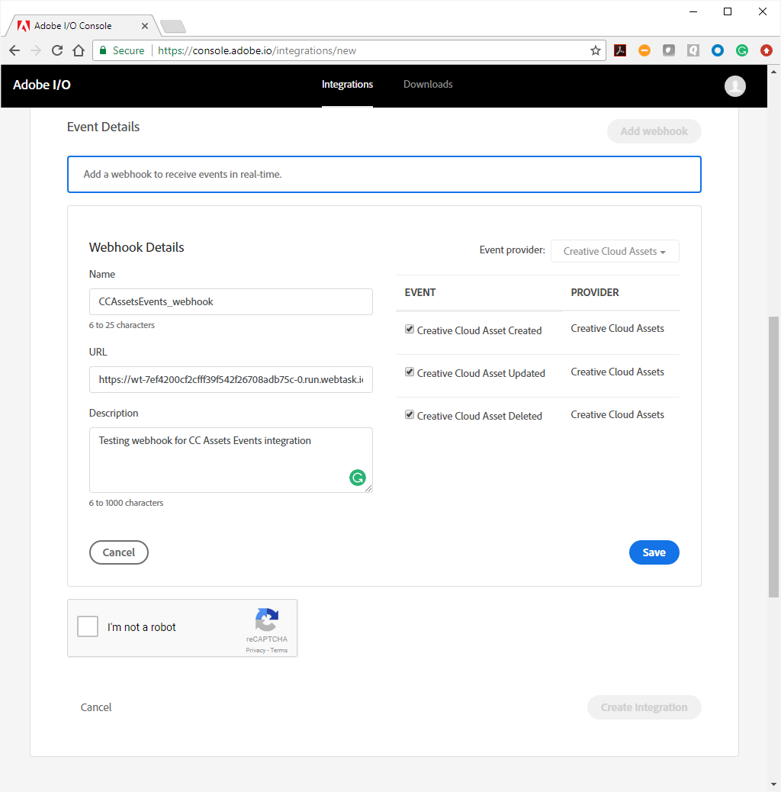

8. Save and complete the CAPTCHA. Select &ldquo;Create  integration&rdquo;. At this point, Adobe Events sends a test event to your webhook&rsquo;s destination URL. If your webhook responds correctly with the contents of the `challenge` parameter, your integration is successfully registered:

    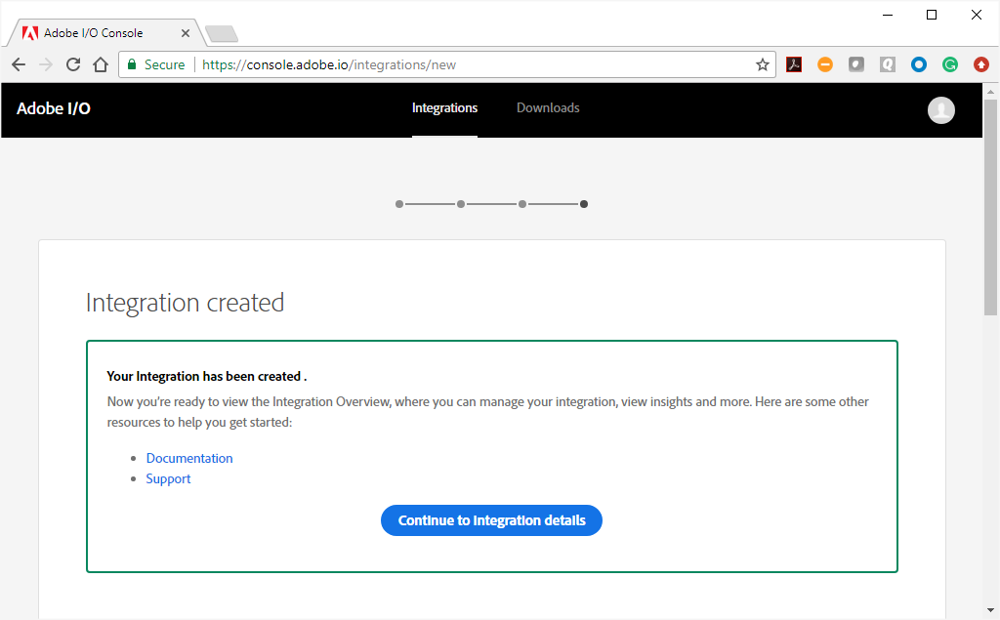

    Select &ldquo;Continue to Integration details&rdquo; to view and manage your integration.

    >**Note:** If you had made an error in transcribing the URL, Adobe Events&rsquo; of your webhook would have failed; instead of seeing the confirmation screen, you&rsquo;d see an error: &ldquo;Webhook verification failed or unreachable&rdquo;. You can also get this error if, for any reason, your webhook&rsquo;s endpoint is down. 

 ## <a id="receive-events">Receive events</a>
 Your integration is now set up, and your webhook is in place; but to receive events, your integration needs to connect to its event provider, Creative Cloud Assets, on behalf of its user. This requires authentication; see [OAuth Integration](#https://www.adobe.io/apis/cloudplatform/console/authentication/oauth_workflow.html). 
 
 Start with the Integration Overview. It&rsquo;s the screen you see immediately after selecting &ldquo;Continue to Integration details&rdquo;.

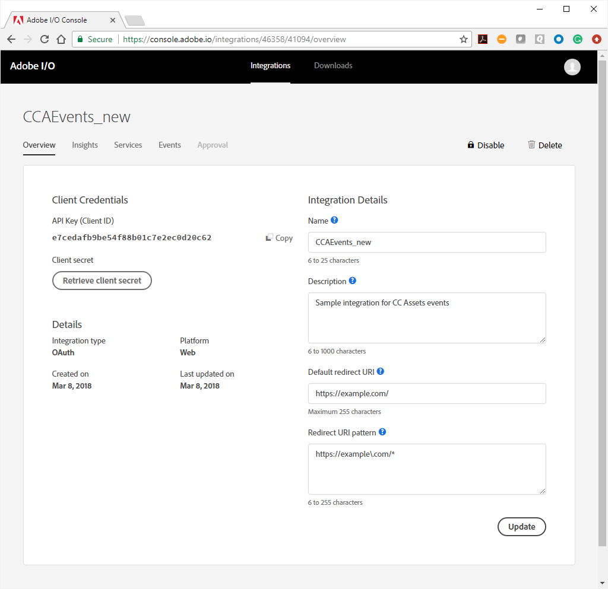

 For authentication setup, you&rsquo;ll need to add the [Creative SDK](https://www.adobe.io/apis/creativecloud/creativesdk/docs/websdk/adobe-creative-sdk-for-web_master/getting-started.html) as a service, and then use the [User Auth UI](https://www.adobe.io/apis/creativecloud/creativesdk/docs/websdk/adobe-creative-sdk-for-web_master/user-auth-ui.html) to build an interface for your user to log into your app and give your app authorization to access Creative Cloud Assets. 

 To add Creative SDK as a service:
 
 1. From the Integration Overview, select the Services tab:

    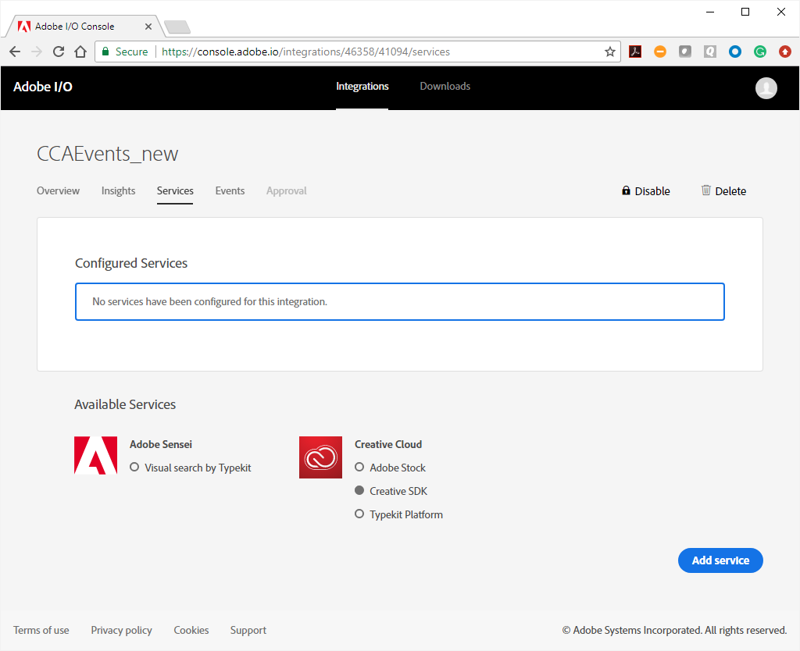

 2. Under Creative Cloud, select &ldquo;Creative SDK&rdquo;, then select &ldquo;Add service&rdquo;. You&rsquo;re now ready to implement the User Auth UI.

 Adobe&rsquo;s User Auth UI lets you build into your application a login function that takes the user&rsquo;s Adobe ID and lets the user give your app permission to access the assets and Adobe Solutions to which they&rsquo;re subscribed. Once your app is authenticated, Adobe will begin to push events to your integration&rsquo;s webhook via HTTP POST messages.

