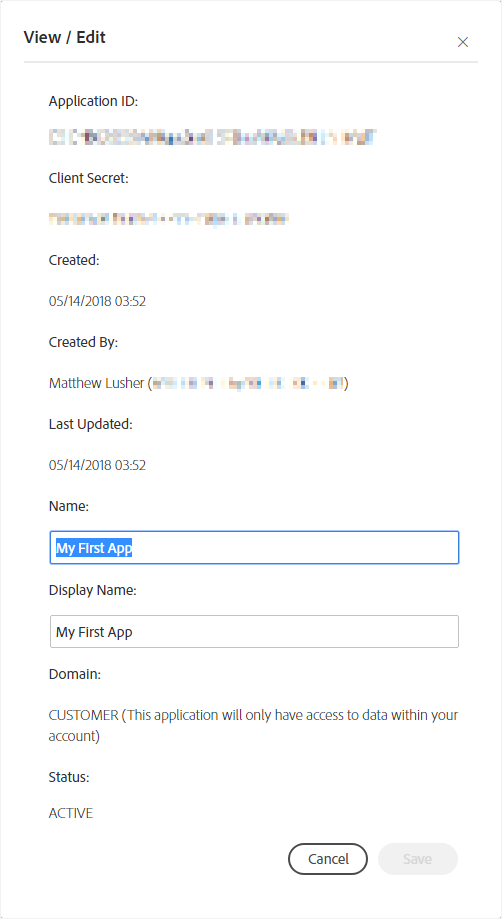
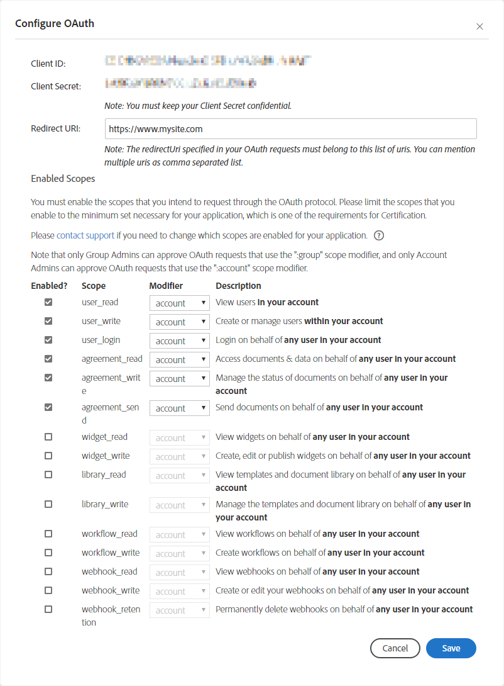

# Configure OAuth for the Application

In the  [previous section](create_app.md), you learned to create an application. Now, you must configure OAuth for your application so that the client-side applications that you build can invoke the Sign APIs.

1. Select **API Applications** to view the list of apps you have created; then select your app to view its action menu.

2. Select **View/Edit** to get the Application ID and secret.  

      
      
    Note down the app&rsquo;s Application ID and secret. You will be using this information to issue access tokens in the Adobe Sign API. 

3. Select **Configure OAuth for Application** to enable scopes.

    

    Remember to limit the scopes that you intend to request through OAuth. The scope denotes the extent of permission that your users will have on your account. 

    The following modifiers are available:

    | **Modifier** | **Description** |
    | --- | --- |
    | `self` | Perform the specified action on behalf of the authorizing user. This is the default: for example, &ldquo;agreement_send:self&rdquo; is the same scope as &ldquo;agreement_send&rdquo; |
    | `group` | Perform the specified action on behalf of any user in the same group as the authorizing user. The authorizing user must be a group admin in order to grant this scope, and must have the Business or Enterprise edition of Adobe Sign. |
    | `account` | Perform the specified action on behalf of any user in the same account as the authorizing user. The authorizing user must be an account admin in order to grant this scope, and must have the Business or Enterprise edition of Adobe Sign. |

Now you are all set to invoke the Sign APIs from your client-side apps. Note that OAuth is widely used by developers to authorize API access. Adobe Sign&rsquo;s implementation complies with the  [OAuth 2.0 specification](https://tools.ietf.org/html/rfc6749).

The OAuth process requires users of your apps to grant permissions before invoking any API.

**IMPORTANT:**  Before you begin using the Sign APIs, read  [Using OAuth to Access Adobe Sign APIs](https://secure.na1.echosign.com/public/static/oauthDoc.jsp).

Next: [Get an access token](get_access_token.md)

