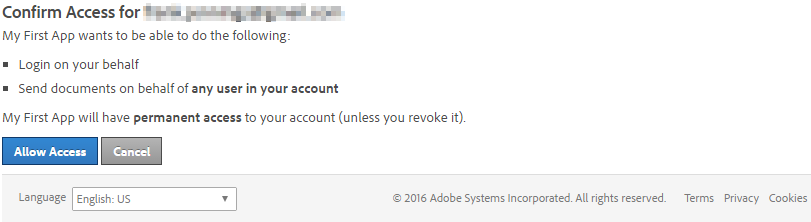

# Get the Access Token

To invoke the Sign APIs, your application must first get an OAuth access token on behalf of an Adobe Sign user. This process uses HTTP requests to obtain the token.

First, copy and paste the following URL in a browser window and change the values for  `redirect_uri` and `client_id`:

```
https://secure.echosign.com/public/oauth?
    redirect_uri=https://myserver.com&
    response_type=code&
    client_id=CBAThIsIsNoTaReAlmPBvPF&
    scope=user_login:self+agreement_send:account
```
The scope parameter that is provided during the OAuth Authorization Request is a space-delimited set of the scopes (and optionally modifiers) specified during the OAuth configuration setup.

For example, `agreement_send:account user_login:self` would allow the application to send on behalf of any user in the account and also login on behalf of the user that authorized the request.

Next, select **Allow Access** to receive the authorization code



Once you select Allow Access, the page gets redirected to the following URL:

```
https://myserver.com/?
    code=CBNCKBAThIsIsNoTaReAlcs_sL4K32wCzs4N&
    api_access_point=https://api.echosign.com&
    web_access_point=https://secure.echosign.com
```

Note the code _CBNCKBAThIsIsNoTaReAlcs_sL4K32wCzs4N_ in the request. This is the authorization code that you will use to get the OAuth access token.

You can send the authorization code along with the Client ID and Client Secret to the Sign Service to get the token. Use the same api_access_point that you got from the previous response.

```
POST http://api.echosign.com/oauth/token?
    code=CBNCKBAThIsIsNoTaReAlcs_sL4K32wCzs4N&
    client_id=CBAThIsIsNoTaReAlmPBvPF&
    client_secret=319UThIsIsNoTaReAl2-4OxkVo9ycU&
    redirect_uri=https://myserver.com&
    grant_type=authorization_code HTTP/1.1

Content-Type: application/x-www-form-urlencoded
```

You will get the following JSON body containing the access token and the refresh token:

```json
{
    "access_token":"3AAABLblThIsIsNoTaReAlToKeNPr6Cv8KcZ9p7E93k2Tf",
    "refresh_token":"3AAABLblThIsIsNoTaReAlToKeNWsLa2ZBVpD0uc*",
    "token_type":"Bearer",
    "expires_in":3600
}
```

Note the following tokens in the response body:

- **Access Token:** You need to use this token to access any Adobe Sign API endpoint.
- **Refresh Token:** If your access token expires, use the refresh token to request for a new access token. You need to keep your Client ID and Client Secret handy to request for a new access token from a refresh token.

