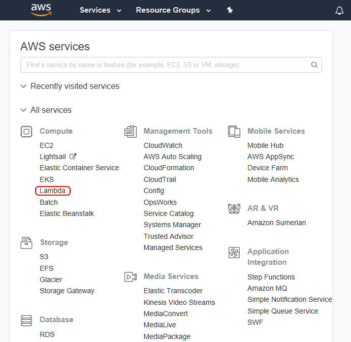
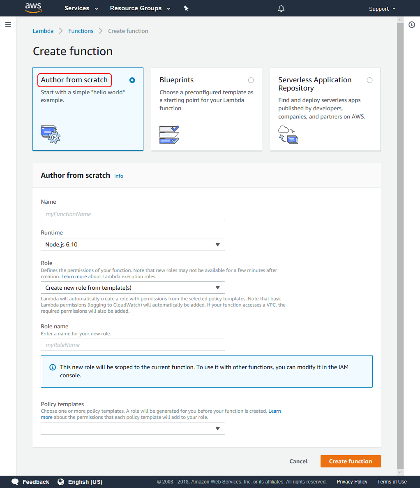
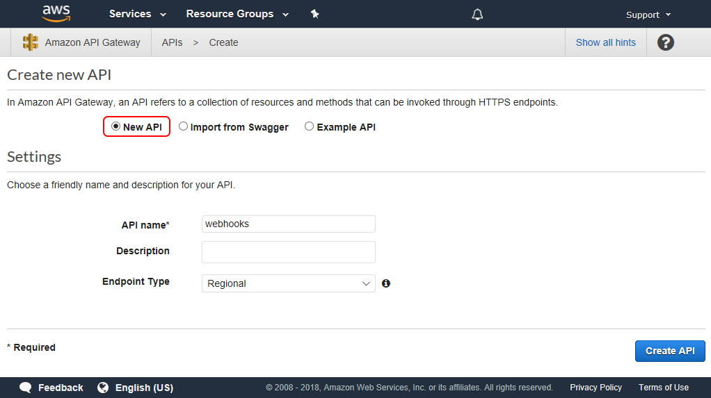
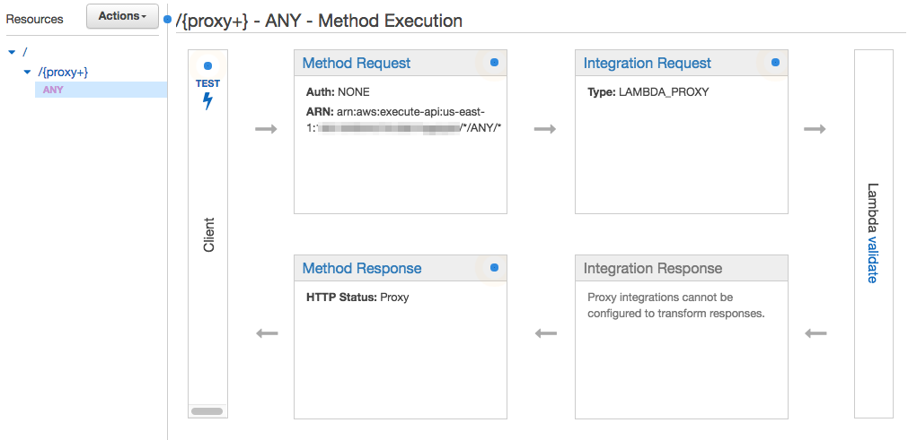
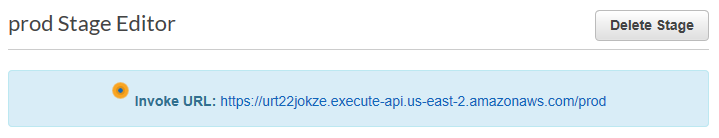

# Using AWS Lambda Functions to Create an Adobe Sign Webhook

## On this page

- [Create an AWS Lambda function](#createanawslambdafunction)
- [Add logic to register your Adobe Sign webhook](#addlogictoregisteryouradobesignwebhook)
- [Configure the AWS API Gateway](#configuretheawsapigateway)
- [Deploy the API](#deploytheapi)
- [Ready to use](#readytouse)

AWS Lambda Functions is a serverless computing service offered by Amazon Web Services. AWS Lambda Functions offer you a platform in which you can execute function code on demand over the internet without the need to manage your own web servers. This gives you a no-overhead solution for hosting functions in the cloud, such as webhooks for Adobe Sign. AWS Lambda Functions support Node.js (JavaScript), Java, Python, C\#, and Go.

## Create an AWS Lambda function

To create an AWS Lambda function:

1.  Login to your [AWS Management Console](https://aws.amazon.com/console/) and select the AWS Lambda service from the services list.

    

2.  Choose to create a Lambda function, then select **Author from Scratch.**

    

3.  In the Configure function page, enter the function name “lambdaWebhooks” and select **Node.js 4.3** as the runtime.

4.  For the role, choose an existing role or **Create a new role from template(s)**.

5.  If you have chosen **Create new role from template(s),** enter a role name (for instance, “role-lambda”) and select **Simple Microservice permissions** from the policy templates list.

6.  Select **Create function**.

7.  On the new AWS lambda function page, select **Edit code inline** as the code entry type; keep index.handler as the Handler.

## Add logic to register your Adobe Sign webhook

Before registering a webhook, Adobe Sign verifies that the webhook URL that is provided in the registration request really intends to receive notifications; see [Verification of Intent](../webhooks.md#verificationofintentofthewebhookurl). For this purpose, when a new webhook registration request is received by Adobe Sign, it first makes an HTTPS GET verification request to the webhook URL with a custom HTTP header, `X-AdobeSign-ClientId`. The value in this header is set to the client ID of the application that is requesting to create and register the webhook. The webhook URL must respond to this verification request with a **2XX response code**, and it must send back the same client ID value in one of the following two ways: Also note the same behaviour for clientID is expected when the Webhook URL receives POST notifications.

**Case 1: Pass the client ID as X-AdobeSign-ClientId in the response header**

This is the same header which was passed in the request, and it must be echoed back in the response.

Replace the contents of the Index.js file with the following code snippet:

```javascript
exports.handler = function index(event, context, callback) {
  // Fetch client id
  var clientid = event.headers['X-AdobeSign-ClientId'];
  
  //Validate it
  if (clientid =="BGBQIIE7H253K6") //Replace 'BGBQIIE7H253K6' with the client id of the application using which the webhook is created
  {
    var response = {
        statusCode: 200,
        headers: {
            "X-AdobeSign-ClientId": clientid
        }
     };
   callback(null,response);
  }
  else {
   callback("Oops!! illegitimate call");
  }
}
```

**Case 2: Pass the client ID in the response body with the key xAdobeSignClientId**

In the JSON response body, pass the key **xAdobeSignClientId** with its value being the same client ID that was sent in the request header.

Replace the contents of the Index.js file with the following code snippet:

```javascript
exports.handler = function index(event, context, callback) {
 // Fetch client id
 var clientid = event.headers['X-AdobeSign-ClientId'];
   
 //Validate it
 if (clientid =="BGBQIIE7H253K6") //Replace 'BGBQIIE7H253K6' with the client id of the application using which the webhook is created
 {
   var responseBody = {
        xAdobeSignClientId : clientid
   };
      
    var response = {
        statusCode: 200,
        body: JSON.stringify(responseBody)
          
    };
   callback(null,response);
 }
 else {
   callback("Opps!! illegitimate call");
  }
}
```

Save the function. The Lambda function is created, and you are almost ready to use it in a real-time webhook.

## Configure the AWS API Gateway

To make this Lambda function publicly accessible through a HTTP method, you need to configure the AWS API Gateway using your function as the backend for the API.

1.  In the AWS Management Console, select **API Gateway** from the AWS Services list.

    >   Note: If this is your first time in the API Gateway console, you’ll see a Getting Started screen. Select Get Started to proceed. Clear the dialog for the example API. If you’ve used the API Gateway service before, simply select Create API to proceed.

2.  In the Create new API page, select **New API** and enter **webhooks** as the **API name**.

    

3.  Select **Create API**.

4.  From the Actions drop-down list, select **Create Resource**.

5.  Check the “Configure as proxy resource” option and enter “validate” as the Resource Name and “{proxy+}” in the Resource Path.

6.  Leave the “Enable API Gateway CORS” option unchecked and select **Create Resource**.

7.  Keep the Lambda Function Proxy selected as the Integration type and select the region where you have created your Lambda function in the Lambda region drop-down list (probably it’s the same region where you are creating the API Gateway).

8.  Enter “validate” as the Lambda Function and select **Save.**

9.  An Add Permission to Lambda Function pop-up window appears; select **OK.**

If all the above steps are executed successfully, you’ll see something like this:



## Deploy the API

The next step is deploying this API so it becomes ready to use:

1.  In the Actions drop-down, select **Deploy API.** The Deploy API dialog appears.

2.  Select **[New Stage]** for the Deployment stage and enter “prod” (or anything you like to identify this stage) for the Stage name.

3.  Select **Deploy.**

The new API is now ready to use. You can find the invoke URL in the blue box as shown below:



Take note of this URL as you’ll need to enter it as your real-time webhook URL.

## Ready to Use

It’s done. Use the above URL with “/{nodeJSfunctionName}” appended as the webhook URL in your `POST /webhooks` API request. Once you have verified the behavior, the webhook URL is functional as per Adobe Sign standards. You can further update your new webhook and add custom logic as needed for your application.
