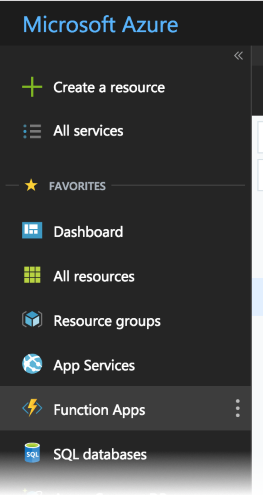
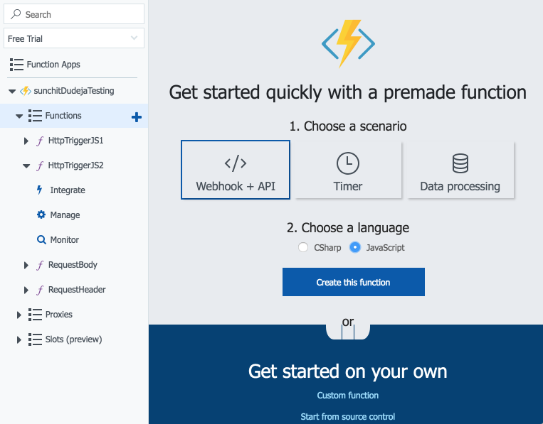
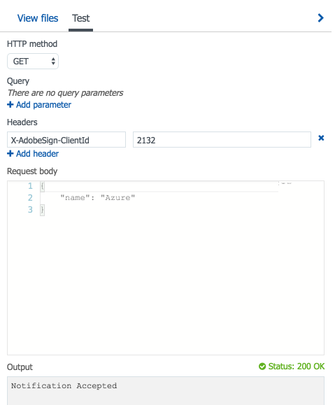
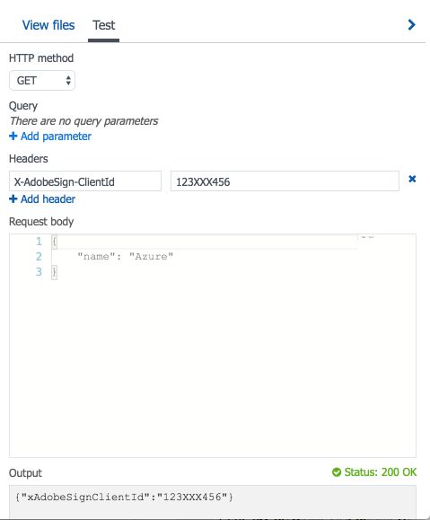
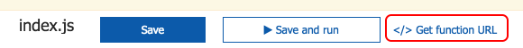
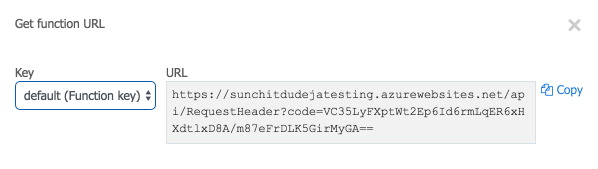

# Using Azure Functions to Create an Adobe Sign Webhook

## On this page

- [Prerequisites](#prerequisites)
- [Steps to create an Azure Functions Trigger that serves as an Adobe Sign Webhook](#stepstocreateanazurefunctionstriggerthatservesasanadobesignwebhook)
    - [Create a JavaScript HttpTrigger function](#createajavascripthttptriggerfunction)
    - [Add logic to register your Adobe Sign webhook](#addlogictoregisteryouradobesignwebhook)
- [Ready to use](#Readytouse)
- [Get the function&rsquo;URL](#getthefunctionsurl)

Azure Functions is Microsoft’s serverless computing cloud platform. Using Azure Functions, you can write functional code and host it in the Azure cloud, ready to execute on demand. This always-on functionality, combined with the ease of management offered by cloud-based serverless architecture, makes Azure Functions a viable alternative for hosting your Adobe Sign webhooks.

Azure Functions executes individual serverless functions within a function app. Function apps can host many different functions, and you can have many function apps on Azure; so the infrastructure enables you to organize related functions into apps.

## Prerequisites

To create and host a webhook in Azure Functions, you need:

1.  A Microsoft account with license to create Azure Functions applications.

2.  An Azure Functions app. If you don't have an existing app, you can create it for the purpose: see [Create your first function in the Azure portal](https://docs.microsoft.com/en-us/azure/azure-functions/functions-create-first-azure-function) in the Azure documentation.

3.  For this example, basic knowledge of JavaScript. Azure Functions understands and executes functions written in several different languages; see [Supported languages in Azure Functions](https://docs.microsoft.com/en-us/azure/azure-functions/supported-languages) in the Azure documentation.

## Steps to create an Azure Functions Trigger that serves as an Adobe Sign Webhook

### Create a JavaScript HttpTrigger function

1.  Login with your Microsoft account at <https://portal.azure.com/>

2.  Select Function Apps from your account dashboard menu. This will open your list of Azure Function apps.  
    
    

3.  Choose the app wherein you want to create this new function.

4.  Select the + icon to create a new Azure function.  
    
    

5.  Select "Webhook + API" as the scenario and "JavaScript" as the language; then select "Create this function".

This will create a new function that has the capability of handling incoming API requests.

### Add logic to register your Adobe Sign webhook

Before registering a webhook successfully, Adobe Sign verifies that the webhook URL that is provided in the registration request really intends to receive notifications; see [Verification of Intent](../webhooks.md#verificationofintentofthewebhookurl). For this purpose, when a new webhook registration request is received by Adobe Sign, it first makes an HTTPS GET verification request to the webhook URL with a custom HTTP header, `X-AdobeSign-ClientId`. The value in this header is set to the client ID of the application that is requesting to create and register the webhook. The webhook URL must respond to this verification request with a **2XX response code**, and it must send back the same client ID value in one of the following two ways:

**Case 1: Pass the client ID as `X-AdobeSign-ClientId` in the response header**

This is the same header which was passed in the request, and it must be echoed
back in the response.

1.  Replace the contents of the index.js file with the following code snippet:

    ```javascript
    module.exports = function (context, req) {
        var clientId = req.headers['x-adobesign-clientid'];
        // Validate that the incoming ClientID is genuine
        if (clientId === '123XXX456') {
            context.res = {
                // status: 200, /* Defaults to 200 */ // any 2XX response is acceptable
                body: "Notification Accepted",
                headers : {
                    'x-adobesign-clientid' : req.headers['x-adobesign-clientid']
                }
            };
        }
        else {
            context.res = {
                status: 400,
                body: "Opps!! Illegitimate Call identified"
            };
        }
        context.done();
    };
    ```

2.  Test the behavior by mocking the request:
    - Select the Test button at the extreme right corner.
    - Mock the dummy request:  
      
        
    Although the response headers are not shown above, you can observe them by mocking the request with developer tools such as [Postman](https://www.getpostman.com/).

**Case 2: Pass the client ID in the response body with the key `xAdobeSignClientId`**

In the JSON response body, pass the key `xAdobeSignClientId` with its value being the same client ID that was sent in the request header.

1.  Replace the index.js file with the following:

    ```javascript
    module.exports = function (context, req) {
        var clientId = req.headers['x-adobesign-clientid'];
        // Validate that the incoming ClientID is genuine
        if (clientId === '123XXX456') {
            context.res = {
                // status: 200, /* Defaults to 200 */ // any 2XX response is acceptable
                body: {
                    'xAdobeSignClientId' : clientId
                },
                headers : {
                    'Content-Type' : 'application/json'
                }
            };
        }
        else {
            context.res = {
                status: 400,
                body: "Opps!! Illegitimate Call identified"
            };
        }
        context.done();
    };
    ```

2.  Test the behavior by mocking the request:
    - Select the Test button at the extreme right corner.
    - Mock the dummy request:  
      

Note: The same behavior for `clientId` is expected when the Webhook URL receives POST notifications.

## Ready to use

It’s done. Once you have verified the behavior, the webhook URL is functional as per Adobe Sign standards. You can further update your new webhook and add custom logic as needed for your application.

## Get the function’s URL

1.  Select **Get function URL:**  
    

2.  Copy the URL and use it for creating webhooks in Adobe Sign.  
    
